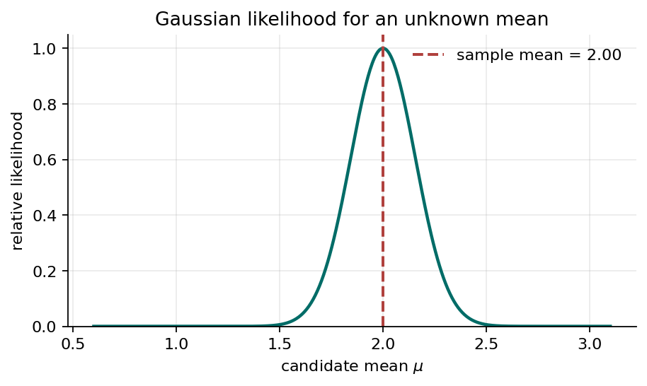
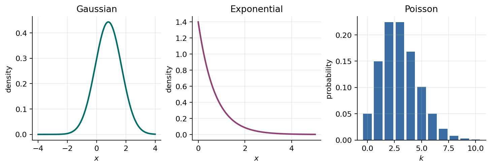

# Bayesian Probability and Inference

This page collects the Bayesian material separately from the numbered lectures for now. It introduces priors, likelihoods, evidence, and posteriors; develops maximum likelihood and Bayesian inference for a Gaussian mean; and introduces the exponential-family framework used by many Bayesian models.

## Bayesian Probability

In the Bayesian view, probability can represent uncertainty about unknown quantities, not only long-run frequencies. A model parameter can be uncertain and can have a probability distribution.

Let $\boldsymbol{\theta}$ be unknown model parameters and let $\mathcal{D}$ be observed data. Bayes' rule gives:

$$
p(\boldsymbol{\theta}\mid\mathcal{D})
=
\frac{p(\mathcal{D}\mid\boldsymbol{\theta})p(\boldsymbol{\theta})}
{p(\mathcal{D})}.
$$

The terms are:

- $p(\boldsymbol{\theta})$: the **prior**, representing uncertainty before seeing the data.
- $p(\mathcal{D}\mid\boldsymbol{\theta})$: the **likelihood**, describing how probable the data are under each parameter value.
- $p(\mathcal{D})$: the **evidence**, which normalizes the posterior.
- $p(\boldsymbol{\theta}\mid\mathcal{D})$: the **posterior**, representing uncertainty after seeing the data.

For continuous parameters, the evidence is an integral:

$$
p(\mathcal{D})=\int p(\mathcal{D}\mid\boldsymbol{\theta})p(\boldsymbol{\theta})\,d\boldsymbol{\theta}.
$$

This is the core Bayesian workflow:

1. Start with a prior distribution.
2. Use the likelihood to connect parameters to data.
3. Compute or approximate the posterior.
4. Use the posterior for prediction or decision-making.

### UAV Example: Sensor Bias

Suppose a UAV's barometer has an unknown altitude bias $b$. Before flight, calibration data suggest the bias is probably near zero, so we choose a prior such as:

$$
b\sim\mathcal{N}(0,\tau_0^2).
$$

During flight, the UAV compares barometer altitude with another altitude estimate and observes data $\mathcal{D}$. Bayes' rule updates the prior into a posterior $p(b\mid\mathcal{D})$. The autopilot can then correct altitude using the posterior mean and inflate its safety margin using the posterior variance.

## Gaussian Likelihood and Bayesian Inference

The Gaussian distribution is useful both for point estimation and for Bayesian inference. The likelihood function appears in both approaches. The difference is that maximum likelihood estimation uses the likelihood to choose a single best parameter value, while Bayesian inference combines the likelihood with a prior to obtain a full posterior distribution over the parameter.

### The Gaussian Likelihood

Suppose altitude measurement errors are modeled as independent Gaussian observations:

$$
x_n\sim\mathcal{N}(\mu,\sigma^2),
\qquad n=1,\ldots,N,
$$

where $\sigma^2$ is known and $\mu$ is unknown. The likelihood of $\mu$ is:

$$
p(\mathcal{D}\mid\mu)
=
\prod_{n=1}^{N}
\mathcal{N}(x_n\mid\mu,\sigma^2).
$$

As a function of $\mu$, this likelihood says which mean values make the observed data most plausible.

*Fig. 1. For Gaussian data with known variance, the likelihood as a function of the mean is maximized at the sample mean.*

### Maximum Likelihood Estimate

Taking the logarithm gives:

$$
\log p(\mathcal{D}\mid\mu)
=
-\frac{N}{2}\log(2\pi\sigma^2)
-\frac{1}{2\sigma^2}
\sum_{n=1}^{N}(x_n-\mu)^2.
$$

Maximizing the likelihood is equivalent to minimizing the sum of squared errors:

$$
\sum_{n=1}^{N}(x_n-\mu)^2.
$$

Therefore the maximum likelihood estimate is:

$$
\mu_{\mathrm{ML}}=\frac{1}{N}\sum_{n=1}^{N}x_n.
$$

Up to this point, we have used the likelihood to compute a point estimate. This is the maximum likelihood approach. To make the model Bayesian, we treat the unknown mean $\mu$ itself as uncertain before seeing the current data.

### Adding a Prior: Bayesian Gaussian Inference

Specifying a **prior** means choosing a probability distribution for the unknown parameter before using the current dataset. For the unknown Gaussian mean, a common choice is another Gaussian:

$$
\mu\sim\mathcal{N}(\mu_0,\tau_0^2).
$$

This statement says that, before observing the current data $\mathcal{D}$, we believe plausible values of $\mu$ are centered around $\mu_0$, with uncertainty measured by $\tau_0^2$.

- $\mu_0$ is the prior mean. It is the value of $\mu$ we would expect before seeing the current data.
- $\tau_0^2$ is the prior variance. A small value means strong prior confidence near $\mu_0$; a large value means weak prior information.

For example, if previous calibration suggests that a UAV altitude sensor has nearly zero average error, we might use $\mu_0=0$. If that calibration was very reliable, we would choose a small $\tau_0^2$. If it was old, limited, or from a different sensor, we would choose a larger $\tau_0^2$.

The prior is not the final answer. It is combined with the likelihood from the current measurements. Values of $\mu$ receive high posterior probability only when they are plausible under the prior and also explain the observed data well.

The posterior is proportional to likelihood times prior:

$$
p(\mu\mid\mathcal{D})
\propto
p(\mathcal{D}\mid\mu)p(\mu).
$$

Because a Gaussian prior is conjugate to a Gaussian likelihood with known variance, the posterior is also Gaussian:

$$
p(\mu\mid\mathcal{D})=\mathcal{N}(\mu_N,\tau_N^2),
$$

where:

$$
\frac{1}{\tau_N^2}
=
\frac{1}{\tau_0^2}
+
\frac{N}{\sigma^2}
$$

and:

$$
\mu_N
=
\tau_N^2
\left(
\frac{\mu_0}{\tau_0^2}
+
\frac{N\bar{x}}{\sigma^2}
\right).
$$

The posterior mean is a precision-weighted compromise between the prior mean $\mu_0$ and the sample mean $\bar{x}$. If the prior variance $\tau_0^2$ is large, the data dominate. If the measurement variance $\sigma^2$ is large or $N$ is small, the prior matters more.

This idea appears throughout Bayesian machine learning. A model does not only output a best estimate; it can also describe uncertainty in that estimate.

## Exponential Family Basics

Many probability distributions used in machine learning belong to the **exponential family**. This family gives a common language for likelihoods, sufficient statistics, conjugate priors, generalized linear models, and many probabilistic deep learning models.

A distribution belongs to the exponential family if it can be written as:

$$
p(x\mid\boldsymbol{\eta})
=
h(x)
\exp\left\{
\boldsymbol{\eta}^\mathsf{T}\mathbf{u}(x)
-A(\boldsymbol{\eta})
\right\}.
$$

The terms are:

- $\boldsymbol{\eta}$: natural parameters.
- $\mathbf{u}(x)$: sufficient statistics.
- $h(x)$: base measure.
- $A(\boldsymbol{\eta})$: log normalizer, ensuring the distribution integrates or sums to 1.

The phrase **sufficient statistic** means that, for inference about the parameter, the data can be compressed into $\sum_n \mathbf{u}(x_n)$ without losing information relevant to that model.

*Fig. 2. The Gaussian, exponential, Bernoulli, Binomial, categorical, Gamma, Beta, and Poisson distributions are all connected through the exponential-family form, although some are continuous and some are discrete.*

### Example: Gaussian with Known Variance

For a Gaussian with known variance $\sigma^2$:

$$
p(x\mid\mu)
=
\frac{1}{\sqrt{2\pi\sigma^2}}
\exp\left\{
-\frac{(x-\mu)^2}{2\sigma^2}
\right\}.
$$

Expanding the square:

$$
-\frac{(x-\mu)^2}{2\sigma^2}
=
\frac{\mu}{\sigma^2}x
-
\frac{\mu^2}{2\sigma^2}
-
\frac{x^2}{2\sigma^2}.
$$

So the Gaussian with known variance can be written in exponential-family form with:

$$
\eta=\frac{\mu}{\sigma^2},
\qquad
u(x)=x.
$$

The remaining terms go into $h(x)$ and $A(\eta)$.

### Why This Matters for Machine Learning

The exponential family matters because it organizes many models that otherwise look unrelated:

- Linear regression with Gaussian noise uses a Gaussian likelihood.
- Logistic regression uses a Bernoulli likelihood.
- Multiclass classification uses a categorical likelihood.
- Count models often use Poisson likelihoods.
- Variational autoencoders and other deep generative models choose likelihoods based on the data type.

In each case, the model predicts parameters of a probability distribution, not just a point value. This is one reason probability distributions are a foundation for modern machine learning and deep learning.

## Summary

Bayesian inference represents uncertainty about unknown parameters with probability distributions. A prior describes uncertainty before observing the current data, a likelihood measures how well candidate parameters explain those data, and Bayes' rule combines them into a posterior. In the Gaussian example, maximum likelihood produces the sample mean as a point estimate, while a Gaussian prior and likelihood produce a Gaussian posterior that balances prior knowledge with new evidence. The exponential family provides a common form for many likelihoods and helps explain sufficient statistics and conjugate prior relationships.

## Practice Questions

### 1. Bayesian Probability with a Gaussian Model: Sensor Bias

A UAV estimates the bias $b$ in an altitude sensor, measured in meters. Before collecting new data, the prior belief is:

$$
b\sim\mathcal{N}(0,4).
$$

During calibration, the UAV records three independent bias measurements:

$$
x_1=1.2,\qquad x_2=0.6,\qquad x_3=0.9.
$$

Assume:

$$
x_n\mid b\sim\mathcal{N}(b,1),
\qquad n=1,2,3.
$$

1. Compute the sample mean $\bar{x}$.
2. Compute the posterior variance $\tau_N^2$.
3. Compute the posterior mean $\mu_N$.
4. Based on the posterior mean, should the altitude estimate be shifted upward or downward?

<!-- #### Solution

The sample mean is:

$$
\bar{x}=\frac{1.2+0.6+0.9}{3}=0.9.
$$

Here:

$$
\mu_0=0,\qquad \tau_0^2=4,\qquad \sigma^2=1,\qquad N=3.
$$

The posterior precision is:

$$
\frac{1}{\tau_N^2}
=
\frac{1}{\tau_0^2}
+
\frac{N}{\sigma^2}
=
\frac{1}{4}+3
=
\frac{13}{4}.
$$

Therefore:

$$
\tau_N^2=\frac{4}{13}\approx 0.3077.
$$

The posterior mean is:

$$
\mu_N
=
\tau_N^2
\left(
\frac{\mu_0}{\tau_0^2}
+
\frac{N\bar{x}}{\sigma^2}
\right).
$$

Substitute the values:

$$
\mu_N
=
\frac{4}{13}
\left(
0+3(0.9)
\right)
=
\frac{10.8}{13}
\approx 0.831.
$$

The posterior estimate of the sensor bias is positive, so the sensor appears to read about $0.831$ meters too high on average. To correct the altitude estimate, subtract this bias from the sensor reading.
-->

## References

- [1] Christopher M. Bishop, *Pattern Recognition and Machine Learning*, Springer, 2006. Book site: <https://www.microsoft.com/en-us/research/people/cmbishop/prml-book/>
- [2] Christopher M. Bishop and Hugh Bishop, *Deep Learning: Foundations and Concepts*, Springer, 2023. Book site: <https://www.bishopbook.com/>
- [3] Kevin P. Murphy, *Probabilistic Machine Learning: An Introduction*, MIT Press, 2022. Book site: <https://probml.github.io/pml-book/book1.html>
