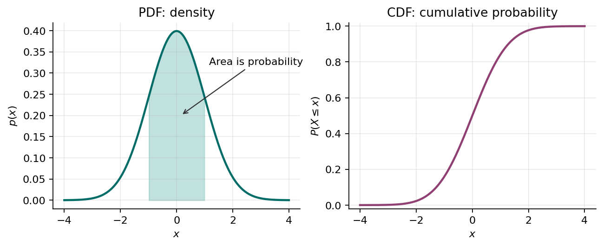
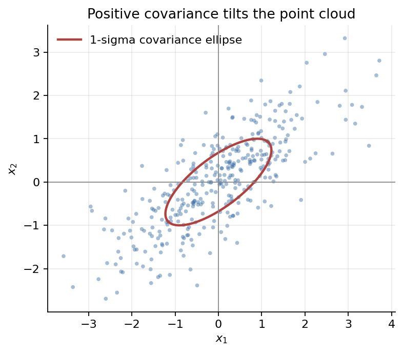

# Lecture 5 - Random Variables and Distributions

This lecture extends discrete probability to continuous random variables and joint distributions. It develops probability densities, cumulative distributions, expectation, variance, multivariable distributions, and covariance. The next lecture applies these foundations to several important distribution families.

## Basics of Densities: PDF and CDF

A continuous random variable can take values over an interval, such as altitude error, GPS position error, airspeed, battery voltage, or a neural network score. Unlike a discrete random variable, a continuous random variable does not assign probability mass to individual points. Instead, it uses a **probability density function** or **PDF**.

For a continuous random variable $X$, the density is written:

$$
p(x).
$$

The probability that $X$ falls in an interval is the area under the density:

$$
P(a \leq X \leq b)=\int_a^b p(x)\,dx.
$$

The density must satisfy:

$$
p(x)\geq 0
\qquad \text{and} \qquad
\int_{-\infty}^{\infty}p(x)\,dx=1.
$$

The probability of one exact value is zero:

$$
P(X=x)=0.
$$

This does **not** mean the value cannot occur. It means that probability is assigned to intervals, not individual points. For example, the probability that a UAV's altitude error is exactly $0.1000000000$ meters is zero under a continuous model, but the probability that the error lies between $0.09$ and $0.11$ meters can be positive.

The **cumulative distribution function** or **CDF** is:

$$
F(x)=P(X\leq x)=\int_{-\infty}^{x}p(t)\,dt.
$$

The CDF is useful because probabilities of intervals can be computed by subtraction:

$$
P(a<X\leq b)=F(b)-F(a).
$$



*Fig. 1. A PDF assigns density, and probability is area under the curve. A CDF gives cumulative probability up to a point.*

## Expectation

The **expectation** of a continuous random variable is its probability-weighted average:

$$
\mathbb{E}[X]=\int_{-\infty}^{\infty}x\,p_X(x)\,dx.
$$

The expectation is the center of mass of the distribution. It need not be a value that is especially likely, but over many repetitions it describes the long-run average when that interpretation applies.

More generally, the expectation of a function $g(X)$ is

$$
\mathbb{E}[g(X)]
=\int_{-\infty}^{\infty}g(x)p_X(x)\,dx.
$$

Expectation is linear. For constants $a$ and $b$,

$$
\mathbb{E}[aX+b]=a\mathbb{E}[X]+b.
$$

Expected values appear in loss functions, risk minimization, reinforcement learning returns, Bayesian prediction, and uncertainty propagation.

## Variance

The **variance** measures the average squared distance from the mean:

$$
\operatorname{Var}(X)=\mathbb{E}[(X-\mu_X)^2],
\qquad \mu_X=\mathbb{E}[X].
$$

Equivalently,

$$
\operatorname{Var}(X)
=\mathbb{E}[X^2]-\mathbb{E}[X]^2.
$$

Variance is always nonnegative. The **standard deviation**

$$
\sigma_X=\sqrt{\operatorname{Var}(X)}
$$

has the same units as $X$, whereas variance has squared units. Shifting a random variable does not change its variance, while scaling it gives

$$
\operatorname{Var}(aX+b)=a^2\operatorname{Var}(X).
$$

## Joint Distributions of Two Random Variables

Two random variables defined on the same experiment must be described together when their relationship matters. For continuous random variables $X$ and $Y$, the **joint probability density function** is written

$$
p_{X,Y}(x,y).
$$

It must satisfy

$$
p_{X,Y}(x,y)\geq 0
$$

and

$$
\int_{-\infty}^{\infty}
\int_{-\infty}^{\infty}
p_{X,Y}(x,y)\,dx\,dy=1.
$$

For a region $\mathcal{R}$ in the $(x,y)$ plane,

$$
P\big((X,Y)\in\mathcal{R}\big)
=\iint_{\mathcal{R}}p_{X,Y}(x,y)\,dx\,dy.
$$

For example, the probability that $X$ and $Y$ both lie in specified intervals is

$$
P(a\leq X\leq b,\;c\leq Y\leq d)
=\int_c^d\int_a^b p_{X,Y}(x,y)\,dx\,dy.
$$

The individual, or **marginal**, densities are obtained by integrating out the other variable:

$$
p_X(x)=\int_{-\infty}^{\infty}p_{X,Y}(x,y)\,dy,
$$

$$
p_Y(y)=\int_{-\infty}^{\infty}p_{X,Y}(x,y)\,dx.
$$

This is the continuous version of marginalization. When $p_Y(y)>0$, the conditional density of $X$ given $Y=y$ is

$$
p_{X\mid Y}(x\mid y)
=\frac{p_{X,Y}(x,y)}{p_Y(y)}.
$$

The joint density contains both the behavior of each variable and information about how they depend on one another. If $X$ and $Y$ are independent, it factors as

$$
p_{X,Y}(x,y)=p_X(x)p_Y(y)
$$

for every $x$ and $y$.

```{admonition} Discrete and continuous joint distributions
For discrete random variables, the same ideas use a joint PMF and sums instead of a joint density and integrals. For example, $p_X(x)=\sum_y p_{X,Y}(x,y)$.
```

## Joint Distributions of More Than Two Random Variables

A collection of $D$ random variables can be written as a random vector

$$
\mathbf{X}=
\begin{bmatrix}
X_1 & X_2 & \cdots & X_D
\end{bmatrix}^{\mathsf T}
\in\mathbb{R}^D.
$$

Its joint density is

$$
p_{\mathbf{X}}(\mathbf{x})
=p_{X_1,\ldots,X_D}(x_1,\ldots,x_D),
$$

with

$$
p_{\mathbf{X}}(\mathbf{x})\geq 0,
\qquad
\int_{\mathbb{R}^D}p_{\mathbf{X}}(\mathbf{x})\,d\mathbf{x}=1,
$$

where $d\mathbf{x}=dx_1\cdots dx_D$. Marginal densities are again obtained by integrating out variables. For example,

$$
p_{X_1,X_2}(x_1,x_2)
=\int_{\mathbb{R}^{D-2}}
p_{\mathbf{X}}(\mathbf{x})\,dx_3\cdots dx_D.
$$

If all $D$ variables are mutually independent, then their joint density factors into

$$
p_{\mathbf{X}}(\mathbf{x})
=\prod_{i=1}^{D}p_{X_i}(x_i).
$$

Otherwise, the joint density must also encode their dependencies. This multivariable representation is used for collections such as image pixels, sensor readings, features in a dataset, or the coordinates of a physical state.

## Expectation and Variance Under a Joint Distribution

The expectation of any function of two jointly distributed random variables is computed using their joint density:

$$
\mathbb{E}[g(X,Y)]
=\int_{-\infty}^{\infty}
\int_{-\infty}^{\infty}
g(x,y)p_{X,Y}(x,y)\,dx\,dy.
$$

Choosing $g(x,y)=x$ or $g(x,y)=y$ gives the individual means:

$$
\mu_X=\mathbb{E}[X]
=\iint x\,p_{X,Y}(x,y)\,dx\,dy,
$$

$$
\mu_Y=\mathbb{E}[Y]
=\iint y\,p_{X,Y}(x,y)\,dx\,dy.
$$

Their individual variances can also be computed from the joint density:

$$
\operatorname{Var}(X)
=\iint (x-\mu_X)^2p_{X,Y}(x,y)\,dx\,dy,
$$

$$
\operatorname{Var}(Y)
=\iint (y-\mu_Y)^2p_{X,Y}(x,y)\,dx\,dy.
$$

These are the same values obtained from the marginal densities $p_X(x)$ and $p_Y(y)$. Linearity of expectation also extends without requiring independence:

$$
\mathbb{E}[aX+bY]=a\mathbb{E}[X]+b\mathbb{E}[Y].
$$

For a random vector, the expectation is the vector of component means:

$$
\boldsymbol{\mu}
=\mathbb{E}[\mathbf{X}]
=\int_{\mathbb{R}^D}\mathbf{x}\,p_{\mathbf{X}}(\mathbf{x})\,d\mathbf{x}.
$$

A random vector does not have a single scalar variance that captures its uncertainty in every direction. Each component $X_i$ has its own variance, but describing how components vary together requires covariance.

## Covariance

The **covariance** of $X$ and $Y$ measures their linear co-variation:

$$
\operatorname{Cov}(X,Y)
=\mathbb{E}[(X-\mu_X)(Y-\mu_Y)].
$$

Using their joint density,

$$
\operatorname{Cov}(X,Y)
=\iint (x-\mu_X)(y-\mu_Y)
p_{X,Y}(x,y)\,dx\,dy.
$$

An equivalent and often convenient expression is

$$
\operatorname{Cov}(X,Y)
=\mathbb{E}[XY]-\mathbb{E}[X]\mathbb{E}[Y].
$$

Positive covariance means the two quantities tend to increase or decrease together. Negative covariance means one tends to increase as the other decreases. Zero covariance means there is no linear relationship, although nonlinear dependence may still exist. Independence implies zero covariance when the relevant moments are finite, but zero covariance does not generally imply independence.

Covariance determines the variance of a linear combination:

$$
\operatorname{Var}(aX+bY)
=a^2\operatorname{Var}(X)
+b^2\operatorname{Var}(Y)
+2ab\operatorname{Cov}(X,Y).
$$

For a random vector $\mathbf{X}\in\mathbb{R}^D$, the **covariance matrix** is

$$
\boldsymbol{\Sigma}
=\operatorname{Cov}(\mathbf{X})
=\mathbb{E}\left[
(\mathbf{X}-\boldsymbol{\mu})
(\mathbf{X}-\boldsymbol{\mu})^{\mathsf T}
\right].
$$

Its entries are

$$
\Sigma_{ij}=\operatorname{Cov}(X_i,X_j).
$$

The diagonal entries are the variances of the individual components, and the off-diagonal entries are their pairwise covariances. The covariance matrix is symmetric and positive semidefinite.



*Fig. 2. Covariance describes how random variables vary together. For two-dimensional Gaussian data, the covariance matrix controls the orientation and width of the elliptical contours.*

### UAV Example: Position Error

Suppose a UAV estimates its horizontal position error as a random vector:

$$
\mathbf{X}=
\begin{bmatrix}
\text{east error}\\
\text{north error}
\end{bmatrix}.
$$

The mean $\boldsymbol{\mu}$ gives the average bias in the estimate. The covariance matrix describes uncertainty and correlation. If east and north errors have positive covariance, then a large east error often comes with a large north error. A planner can use this covariance to keep a larger safety margin when flying near obstacles.

## Summary

Continuous random variables use densities rather than probability masses. PDFs describe density, CDFs accumulate probability, expectation describes a distribution's average, and variance measures its spread. A joint density describes two or more random variables together; integrating out variables produces marginal densities, while integrating functions against the joint density produces expectations and componentwise variances. Covariance captures linear co-variation, and the covariance matrix extends this description to a random vector.

## Practice Problems and Solutions

### 1. PDF and CDF: UAV Altitude Error

A UAV's altitude error $X$, measured in meters, is modeled as uniformly distributed between $-2$ and $2$:

$$
p(x)=
\begin{cases}
\frac{1}{4}, & -2\leq x\leq 2,\\
0, & \text{otherwise}.
\end{cases}
$$

1. Write the CDF $F(x)=P(X\leq x)$ as a piecewise function.
2. Compute $P(-0.5\leq X\leq 0.5)$.
3. Compute $F(1)$.
4. Compute $P(-1<X\leq 1.5)$ using the CDF.


```{admonition} Solution
:class: dropdown
Since the density is uniform on an interval of length 4, the CDF increases linearly from 0 to 1 over $[-2,2]$:

$$
F(x)=
\begin{cases}
0, & x<-2,\\
\frac{x+2}{4}, & -2\leq x\leq 2,\\
1, & x>2.
\end{cases}
$$

The probability that the altitude error lies between $-0.5$ and $0.5$ is:

$$
P(-0.5\leq X\leq 0.5)
=\int_{-0.5}^{0.5}\frac{1}{4}\,dx
=\frac{1}{4}=0.25.
$$

Also:

$$
F(1)=\frac{1+2}{4}=\frac{3}{4}=0.75.
$$

Using the CDF:

$$
P(-1<X\leq 1.5)=F(1.5)-F(-1)
=\frac{3.5}{4}-\frac{1}{4}
=0.625.
$$
```

### 2. Normalizing a Density and Computing Its Moments

Suppose a continuous random variable $X$ has density

$$
p_X(x)=
\begin{cases}
c x^2, & 0\leq x\leq 2,\\
0, & \text{otherwise}.
\end{cases}
$$

1. Find the constant $c$.
2. Find $P(X\leq 1)$.
3. Find $\mathbb{E}[X]$ and $\operatorname{Var}(X)$.

```{admonition} Solution
:class: dropdown
A density must integrate to 1, so

$$
1=\int_0^2 cx^2\,dx
=c\left[\frac{x^3}{3}\right]_0^2
=\frac{8c}{3}.
$$

Therefore,

$$
c=\frac{3}{8}.
$$

The requested probability is

$$
P(X\leq 1)
=\int_0^1\frac{3}{8}x^2\,dx
=\frac{1}{8}.
$$

The expectation is

$$
\begin{aligned}
\mathbb{E}[X]
&=\int_0^2 x\left(\frac{3}{8}x^2\right)\,dx\\
&=\frac{3}{8}\left[\frac{x^4}{4}\right]_0^2\\
&=\frac{3}{2}.
\end{aligned}
$$

To compute the variance, first find the second moment:

$$
\begin{aligned}
\mathbb{E}[X^2]
&=\int_0^2 x^2\left(\frac{3}{8}x^2\right)\,dx\\
&=\frac{3}{8}\left[\frac{x^5}{5}\right]_0^2\\
&=\frac{12}{5}.
\end{aligned}
$$

Hence,

$$
\operatorname{Var}(X)
=\mathbb{E}[X^2]-\mathbb{E}[X]^2
=\frac{12}{5}-\left(\frac{3}{2}\right)^2
=\frac{3}{20}.
$$
```

### 3. Marginals and Conditionals from a Joint Density

Let $X$ and $Y$ have joint density

$$
p_{X,Y}(x,y)=
\begin{cases}
x+y, & 0\leq x\leq 1,\;0\leq y\leq 1,\\
0, & \text{otherwise}.
\end{cases}
$$

1. Verify that this is a valid joint density.
2. Find the marginal densities $p_X(x)$ and $p_Y(y)$.
3. Find $P(X\leq 1/2,Y\leq 1/2)$.
4. Find $P(X\leq 1/2\mid Y=1/2)$ using the conditional density.

```{admonition} Solution
:class: dropdown
The density is nonnegative on its support. Its integral is

$$
\begin{aligned}
\int_0^1\int_0^1(x+y)\,dy\,dx
&=\int_0^1\left(x+\frac{1}{2}\right)dx\\
&=\frac{1}{2}+\frac{1}{2}\\
&=1,
\end{aligned}
$$

so it is normalized. Integrating out $Y$ gives

$$
p_X(x)=\int_0^1(x+y)\,dy=x+\frac{1}{2},
\qquad 0\leq x\leq 1.
$$

By symmetry,

$$
p_Y(y)=y+\frac{1}{2},
\qquad 0\leq y\leq 1.
$$

The probability over the lower-left quarter of the unit square is

$$
\begin{aligned}
P\left(X\leq\frac12,Y\leq\frac12\right)
&=\int_0^{1/2}\int_0^{1/2}(x+y)\,dy\,dx\\
&=\frac18.
\end{aligned}
$$

At $y=1/2$, the marginal density is $p_Y(1/2)=1$. Therefore,

$$
p_{X\mid Y}\left(x\mid\frac12\right)
=\frac{x+1/2}{1}
=x+\frac12,
\qquad 0\leq x\leq1.
$$

Integrating this conditional density gives

$$
\begin{aligned}
P\left(X\leq\frac12\mid Y=\frac12\right)
&=\int_0^{1/2}\left(x+\frac12\right)dx\\
&=\frac18+\frac14\\
&=\frac38.
\end{aligned}
$$
```

### 4. Expectation, Variance, and Covariance from a Joint Density

Continue with the joint density $p_{X,Y}(x,y)=x+y$ on the unit square. Find $\mathbb{E}[X]$, $\operatorname{Var}(X)$, $\operatorname{Cov}(X,Y)$, and $\operatorname{Var}(X+Y)$.

```{admonition} Solution
:class: dropdown
Using the joint density,

$$
\begin{aligned}
\mathbb{E}[X]
&=\int_0^1\int_0^1x(x+y)\,dy\,dx\\
&=\int_0^1\left(x^2+\frac{x}{2}\right)dx\\
&=\frac13+\frac14
=\frac{7}{12}.
\end{aligned}
$$

By symmetry, $\mathbb{E}[Y]=7/12$. The second moment of $X$ is

$$
\begin{aligned}
\mathbb{E}[X^2]
&=\int_0^1\int_0^1x^2(x+y)\,dy\,dx\\
&=\int_0^1\left(x^3+\frac{x^2}{2}\right)dx\\
&=\frac14+\frac16
=\frac{5}{12}.
\end{aligned}
$$

Therefore,

$$
\operatorname{Var}(X)
=\frac{5}{12}-\left(\frac{7}{12}\right)^2
=\frac{11}{144}.
$$

By symmetry, $\operatorname{Var}(Y)=11/144$. Next,

$$
\begin{aligned}
\mathbb{E}[XY]
&=\int_0^1\int_0^1xy(x+y)\,dy\,dx\\
&=\frac13.
\end{aligned}
$$

Thus,

$$
\begin{aligned}
\operatorname{Cov}(X,Y)
&=\mathbb{E}[XY]-\mathbb{E}[X]\mathbb{E}[Y]\\
&=\frac13-\left(\frac{7}{12}\right)^2\\
&=-\frac{1}{144}.
\end{aligned}
$$

Finally,

$$
\begin{aligned}
\operatorname{Var}(X+Y)
&=\operatorname{Var}(X)+\operatorname{Var}(Y)
+2\operatorname{Cov}(X,Y)\\
&=\frac{11}{144}+\frac{11}{144}-\frac{2}{144}\\
&=\frac{5}{36}.
\end{aligned}
$$
```

## References

- [1] Christopher M. Bishop, *Pattern Recognition and Machine Learning*, Springer, 2006. Book site: <https://www.microsoft.com/en-us/research/people/cmbishop/prml-book/>
- [2] Christopher M. Bishop and Hugh Bishop, *Deep Learning: Foundations and Concepts*, Springer, 2023. Book site: <https://www.bishopbook.com/>
- [3] Kevin P. Murphy, *Probabilistic Machine Learning: An Introduction*, MIT Press, 2022. Book site: <https://probml.github.io/pml-book/book1.html>
