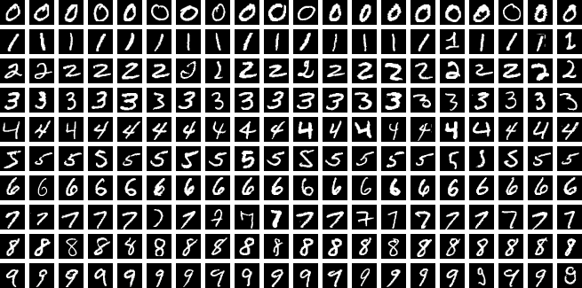

# Lecture 1 - Motivation

Statistical analysis is the process of using limited, noisy data to make defensible claims about a larger population, an underlying process, or future observations. The central goal of this class is to discover useful patterns from observed data and use those patterns to make reliable predictions or decisions about data that have not yet been observed.

## Why learn from data?

In a traditional computer program, a developer specifies the rules that transform an input into an output. This works well when the rules are known and can be written down precisely. For example, a program can calculate sales tax from a known tax rate or sort a list using a prescribed algorithm.

Many important problems do not have such a convenient rulebook. The difficulty is not that we have failed to write enough instructions. It is that the useful pattern is buried under variation, noise, interacting factors, or behavior that changes over time.



*Image credit: [Suvanjanprasai, “MNIST dataset example”](https://commons.wikimedia.org/wiki/File:MNIST_dataset_example.png), via Wikimedia Commons, licensed under [CC BY-SA 4.0](https://creativecommons.org/licenses/by-sa/4.0/). Unmodified.*

::::{grid} 1 1 2 2
:gutter: 3

:::{grid-item-card} Handwritten digit recognition

Imagine writing rules that tell a computer whether an image contains a 3, 5, or 8. One person writes a narrow 3, another makes it almost circular, and a third leaves the loops partly open. Digits may be shifted, rotated, faint, smudged, or written with different pens. Even the same person does not produce an identical image twice.

A rule for every possible stroke and exception would quickly become unmanageable. Pattern recognition instead learns from many labeled examples which visual differences matter for identifying a digit and which differences can safely be ignored.
:::

:::{grid-item-card} Did a process improvement actually work?
A factory changes its cooling procedure and observes fewer defective parts the following week. It is tempting to declare the change successful. But perhaps that week's raw materials were better, production volume was lower, or the apparent improvement was ordinary random fluctuation.

Statistical analysis helps separate a repeatable effect from coincidence. It asks how much evidence the data provide, how uncertain the estimated improvement is, and whether the conclusion is likely to apply beyond the particular week that was observed.
:::

:::{grid-item-card} Predicting equipment failure
A machine may fail after a subtle combination of rising vibration, slightly higher temperature, unusual sound, heavy recent use, and its maintenance history. None of these measurements alone may cross an obvious alarm threshold.

A collection of fixed “if–then” rules can miss interactions or trigger too many false alarms. Machine learning can use historical examples to discover combinations that tend to precede failure and estimate which machines require attention before a breakdown occurs.
:::

:::{grid-item-card} Detecting spam or fraud as behavior changes
A rule that blocks every message containing “free” will reject legitimate email while missing scams that use different wording. A rule that flags every unusually large purchase will inconvenience customers and still miss a sequence of smaller fraudulent transactions.

Spam senders and fraudsters also adapt once a rule becomes predictable. Data-driven systems can learn patterns involving many clues and can be updated as those patterns change, although their performance must continue to be monitored.
:::

::::

### What these examples have in common

These problems share several features:

- valid cases can look very different from one another;
- different categories can sometimes look deceptively similar;
- measurements are incomplete, noisy, or affected by context;
- several weak clues may become useful only when considered together;
- the observed data contain both genuine structure and random variation; and
- the system must work on future cases, not only the examples already seen.

Rules remain valuable when requirements are exact—for example, enforcing a safety limit or validating the format of an identification number. The difficulty arises when we try to describe every legitimate variation and every possible exception in advance.

This is where the three perspectives used in this course complement one another:

- **Pattern recognition** identifies meaningful structure despite variation in how observations appear.
- **Statistical analysis** asks whether an apparent pattern is supported by evidence rather than chance and communicates the uncertainty in a conclusion.
- **Machine learning** uses examples to construct models that can make predictions or decisions for new cases.

Instead of attempting to specify every rule by hand, we provide representative data, choose an appropriate model, and evaluate whether the learned pattern remains useful on observations it has not seen before.

:::{admonition} The central objective
:class: tip

The objective is not to memorize the examples we already have. It is to learn enough structure from those examples to perform well on new data.
:::

## Learning from examples

Suppose an observation is represented by an input vector

$$
\mathbf{x} = [x_1,x_2,\ldots,x_D]^T,
$$

where the entries are measurable features. For a grayscale image, the features could be pixel intensities. For a manufacturing process, they could include temperature, pressure, vibration, and cycle time.

In a supervised problem, each training input $\mathbf{x}_n$ is paired with a desired output, or **target**, $t_n$. The training data are

$$
\mathcal{D}=\{(\mathbf{x}_n,t_n)\}_{n=1}^{N}.
$$

A learning algorithm uses $\mathcal{D}$ to construct a function that maps an input to a prediction. Once constructed, the model should also give useful predictions for inputs that were not in $\mathcal{D}$. If the model learned a "good" function, then it is able to accurately predict the target $t$ for input $x$ that is not in the training data. This is called **generalizability** of the model.

### Three broad learning settings

| Setting | Information available during learning | Typical goal | Example |
|---|---|---|---|
| **Supervised learning** | Inputs and their target outputs | Predict the target for a new input | Classify an image or predict a numerical value |
| **Unsupervised learning** | Inputs without target labels | Discover structure in the data | Find clusters, estimate a distribution, or create a lower-dimensional representation |
| **Reinforcement learning** | Feedback from actions taken in an environment | Learn actions that maximize long-term reward | Select a control action or learn a sequential strategy |

Supervised learning contains two common types of problems:

- **Classification:** the target belongs to one of a finite set of categories, such as defective or acceptable.
- **Regression:** the target is a continuous quantity, such as demand, temperature, or time to failure.

The pattern recognition system may also require **preprocessing** or **feature extraction**. For example, a handwritten digit image might be centered and scaled before it is classified. A good representation can make the pattern easier to learn or speed up computation, while a poor representation can hide useful information.

## Generalization is the real test

The data $\mathcal{D}$ used to fit a model form the **training set**. Performance on those examples tells us how well the model fits data it has already seen. It does not, by itself, tell us how the model will behave in the future.

**Generalization** is the ability to make accurate predictions for new observations drawn under the same relevant conditions as the training data. This distinction produces two different questions:

1. How closely does the model fit the training data?
2. How well does the fitted model predict new data?

These questions can have very different answers. A sufficiently flexible model may reproduce every training target and still make poor predictions elsewhere.

## A guiding example: polynomial curve fitting

Consider a regression problem with one input $x$ and one target $t$. Suppose the data are generated from a smooth relationship with random measurement variation. A convenient illustrative relationship is

$$
t = \sin(2\pi x)+\varepsilon,
$$

where $\varepsilon$ represents noise. We observe only a finite set

$$
\mathcal{D}=\{(x_n,t_n)\}_{n=1}^{N},
$$

not the underlying curve or the noise that produced each deviation from it.

We choose a polynomial model of degree $M$:

$$
y(x,\mathbf{w})
=w_0+w_1x+w_2x^2+\cdots+w_Mx^M
=\sum_{j=0}^{M}w_jx^j.
$$

Here:

- $M$ controls the form and flexibility of the model;
- $\mathbf{w}=[w_0,w_1,\ldots,w_M]^T$ contains the model's adjustable parameters; and
- $y(x,\mathbf{w})$ is the prediction at input $x$.

### Fitting the parameters

One way to select $\mathbf{w}$ is to minimize the **sum-of-squares error**

$$
E(\mathbf{w})
=\frac{1}{2}\sum_{n=1}^{N}
\left[y(x_n,\mathbf{w})-t_n\right]^2.
$$

Each residual $y(x_n,\mathbf{w})-t_n$ measures the difference between a prediction and its observed target. Squaring makes positive and negative residuals contribute in the same direction and penalizes larger discrepancies more heavily. The best-fitting parameters under this criterion are

$$
\mathbf{w}^{*}=\arg\min_{\mathbf{w}} E(\mathbf{w}).
$$

The factor $1/2$ does not change the minimizing value. It is included because it simplifies derivatives, which will become useful when we study optimization.

## Model complexity: too little, too much, or enough?

```{figure} ../figures/polynomial_fits.png
---
name: polynomial-fits
alt: Plots showing different $M$-order polynomials fitting the data (taken from Bishop)
---
Plots showing different order polynomials fitting the data (taken from Bishop).
```


Changing $M$ changes the set of curves the model can represent.

| Polynomial degree | Typical behavior | Main problem |
|---|---|---|
| $M=0$ or $M=1$ | The curve is too rigid to capture the underlying pattern | **Underfitting** |
| A moderate $M$ | The curve captures the broad pattern without following every fluctuation | Better generalization |
| A large $M$ relative to $N$ | The curve can bend sharply to pass through nearly every training point | **Overfitting** |

An **underfit** model makes assumptions that are too restrictive. Both its training and new-data errors tend to be high because it misses important structure.

An **overfit** model adapts not only to the underlying pattern but also to accidental variation in the particular training sample. Its training error may be extremely small, yet its predictions between or beyond the observed points can be unstable.

This leads to a crucial lesson:

$$
\text{small training error} \not\Longrightarrow \text{good generalization}.
$$

### Comparing errors across data sets

The raw sum-of-squares error grows with the number of observations, so we introduce the root-mean-square error that is normalized by the number of observations

$$
E_{\mathrm{RMS}}
=\sqrt{\frac{2E(\mathbf{w}^{*})}{N}}.
$$

This quantity is on the same scale as the target and makes errors from data sets of different sizes easier to compare. If training RMS error keeps decreasing as $M$ grows while test RMS error eventually rises, the separation between those curves is evidence of overfitting.

## Why not always choose the most flexible model?

For a fixed training set, increasing model flexibility cannot make the best achievable training fit worse: a more flexible model has more ways to adapt to the observations. But this is precisely why training error alone cannot select a model.

A high-degree polynomial may require very large positive and negative coefficients that nearly cancel at the training inputs. Small changes in $x$ or in the observed targets can then produce large changes in the fitted curve. The model has become sensitive to details of one sample rather than stable features of the relationship.

This issue is not unique to polynomials. It appears whenever a model has enough flexibility to learn noise, including decision trees, regression models with many predictors, and neural networks.

## More data can help

The meaning of "too complex" depends partly on how much data are available. A ninth-degree polynomial fitted to ten observations has enough freedom to interpolate them exactly. The same degree fitted to a much larger sample is constrained by many more observations and may reveal the broader pattern more reliably.

More representative data can therefore reduce overfitting, but collecting data may be expensive, slow, or ethically constrained. More data also do not automatically correct biased sampling, incorrect labels, irrelevant features, or a mismatch between the training environment and the deployment environment.

The practical question is not simply "Is this model complex?" It is:

> Is the model's complexity appropriate for the amount, quality, and structure of the available data?

## Regularization: preferring smoother explanations

Instead of reducing the polynomial degree, we can retain a flexible model while discouraging extreme parameter values. Add a penalty to the fitting objective:

$$
\widetilde{E}(\mathbf{w})
=\frac{1}{2}\sum_{n=1}^{N}
\left[y(x_n,\mathbf{w})-t_n\right]^2
+\frac{\lambda}{2}\sum_{j=1}^{M}w_j^2.
$$

The first term rewards agreement with the training observations. The second term penalizes large coefficients; the intercept $w_0$ is left unpenalized here. The nonnegative **regularization parameter** $\lambda$ controls the tradeoff:

- when $\lambda$ is near zero, the data-fitting term dominates and the model can vary sharply;
- for an intermediate value, the penalty can suppress unstable behavior while retaining useful structure; and
- when $\lambda$ is too large, the coefficients are shrunk so strongly that the model underfits.

Regularization expresses a preference among models that fit the data: when their fits are similar, prefer the less extreme explanation. The degree $M$ and regularization strength $\lambda$ are examples of **hyperparameters**—choices that shape the learning procedure rather than parameters fitted directly by minimizing the training error.

## Evaluating a model

Because training performance is optimistic, model development separates data by purpose:

- The **training set** is used to fit model parameters.
- A **validation set**, or a cross-validation procedure, is used to compare model choices such as $M$ and $\lambda$.
- The **test set** is reserved for a final estimate of performance on unseen data.

If the test set repeatedly influences model choices, it is no longer an honest test: information about it has leaked into the development process. A model can then overfit the test set indirectly, even if its examples were never used in the parameter-fitting equation.

Good evaluation also requires the evaluation data to represent the conditions in which the model will be used. A random split cannot protect us from every distribution shift. For time-dependent data, grouped observations, repeated measurements, or data collected at different sites, the splitting strategy must reflect the prediction task.

## What the example leaves unanswered

Polynomial curve fitting exposes several questions that least squares alone cannot answer:

- Where does measurement noise come from, and how should it be represented?
- Why should squared error be the objective rather than some other loss?
- How certain should we be about a prediction far from the observed inputs?
- How should we compare models with different levels of flexibility?
- How can prior knowledge be combined with observed data?
- What conclusions are justified when the available data are limited?

## Motivating TECH 65000

The curve-fitting example contains the basic ingredients of a much larger quantitative analysis workflow:

| Challenge revealed by the example | Course tools used to address it |
|---|---|
| Represent inputs, parameters, and transformations efficiently | Linear algebra and calculus |
| Describe noise and uncertain outcomes | Probability, random variables, and distributions |
| Connect assumptions about data to a fitting objective | Probabilistic models and likelihood |
| Estimate unknown quantities from finite samples | Statistical inference and optimization |
| Quantify uncertainty and incorporate prior information | Bayesian inference |
| Detect and control overfitting | Validation, cross-validation, and regularization |
| Turn mathematical ideas into reproducible analyses | Python and Jupyter |
| Decide whether a result supports a real claim or action | Experimental reasoning and clear communication |

Throughout the course, we will repeatedly return to the same sequence:

1. Define the question and the quantity to be predicted or estimated.
2. Represent the observations and state the assumptions.
3. Choose a model and an objective.
4. Fit the model using data.
5. Evaluate it on information not used for fitting.
6. Quantify uncertainty, diagnose failure modes, and communicate the result.


## Reading

Christopher M. Bishop, *Pattern Recognition and Machine Learning*, Springer, 2006, Chapter 1, pages 1–12.

- [Official book page and free PDF](https://www.microsoft.com/en-us/research/publication/pattern-recognition-machine-learning/)
