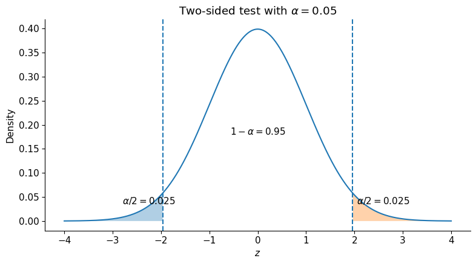
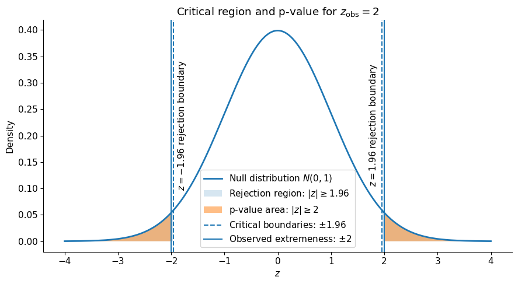
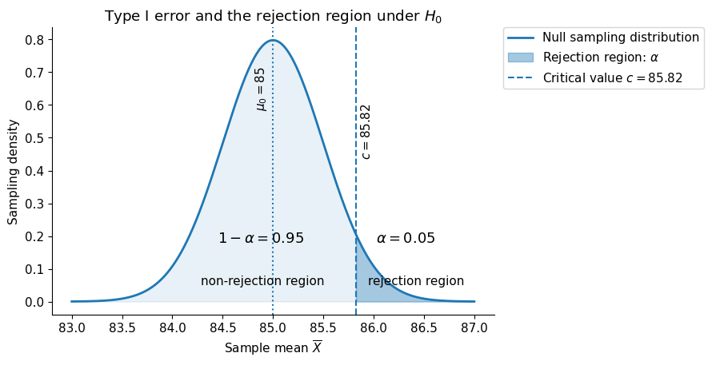
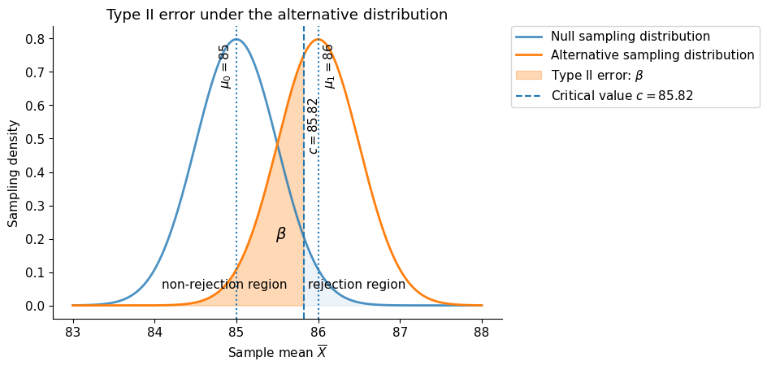
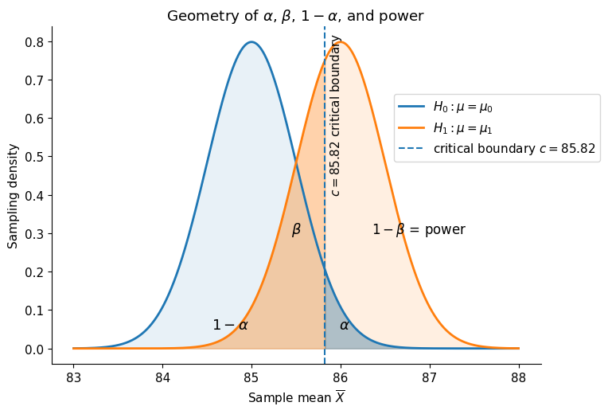

# Lecture 10 - Frequentist Uncertainty and Hypotheses Testing (II/II)

Lecture 9 developed the frequentist account of **sampling uncertainty**. We distinguished populations from samples, treated the sample mean as a random estimator, derived its standard error, introduced the central limit theorem, and constructed confidence intervals. This lecture continues directly from that foundation.

In Lecture 7, we treated model parameters as **fixed but unknown** and learned them from observed data using likelihood and maximum-likelihood estimation.

In Lecture 9, we then asked how a statistic such as the sample mean varies across hypothetical repeated samples. We now use that sampling distribution to evaluate claims about the unknown population parameter.

Suppose someone proposes that

$$
\mu=\mu_0.
$$

If this proposal is correct, then the sampling distribution of the sample mean is centered at $\mu_0$. We can therefore ask:

> Is the observed sample mean reasonably compatible with the sampling distribution implied by $\mu=\mu_0$, or is it unusually far into its tails?

Thus, the guiding question for this lecture is:

> How can we use sampling distributions to evaluate a statistical hypothesis, quantify the strength of evidence against it, and understand the errors associated with a testing procedure?

Lectures 7 and 9 provide the foundations for the hypothesis testing developed in this lecture.

:::{admonition} How Lectures 7, 9, and 10 connect
:class: important

The three lectures use the same statistical model but ask different questions.

| Lecture | Main mathematical object | Principal question |
|---|---|---|
| **Lecture 7: Parameter estimation** | Likelihood $L(\theta;\mathbf{x})$ and estimator $\widehat{\theta}_{\mathrm{ML}}$ | Given one observed sample, which parameter value best explains the data? |
| **Lecture 9: Sampling uncertainty** | Sampling distribution of $\widehat{\theta}$ | How would the estimator vary if the complete sampling procedure were hypothetically repeated? |
| **Lecture 10: Hypothesis testing** | Null distribution of $T(\mathbf{X})$ under $H_0$ | Is the observed statistic compatible with a proposed parameter value $\theta_0$? |

The progression is

$$
\boxed{
\text{estimate the parameter}
\;\longrightarrow\;
\text{quantify the estimator's uncertainty}
\;\longrightarrow\;
\text{evaluate a claim about the parameter}
}
$$

For the population mean, this becomes

$$
\widehat{\mu}_{\mathrm{ML}}=\overline{X}
\quad\longrightarrow\quad
\operatorname{SE}(\overline{X})
=\frac{\sigma}{\sqrt{N}}
\quad\longrightarrow\quad
Z=\frac{\overline{X}-\mu_0}{\sigma/\sqrt{N}}.
$$

In short, Lecture 7 derives the estimator, Lecture 9 characterizes its repeated-sampling uncertainty, and Lecture 10 uses that uncertainty to test a claim about the population parameter.

:::


## Learning objectives

After completing the lecture and tutorial, students should be able to:

1. Formulate appropriate null and alternative hypotheses for a population parameter and distinguish between one-sided and two-sided alternatives.
2. Select and compute a test statistic for a simple one-sample mean problem.
3. Define and correctly interpret a p-value as a probability calculated under the null model, and compare it with a prespecified significance level $\alpha$.
4. Identify Type I and Type II errors in an applied scenario.
5. Explain the relationships among $\alpha$, $\beta$, power, effect size, sample size, and variability.
6. Relate a two-sided hypothesis test to the corresponding confidence interval.
7. Recognize limitations involving multiple testing, assumption violations, and data-dependent hypotheses.

## 1. Recap: From parameter estimation to statistical inference

It is useful to place this lecture in the sequence developed so far.

In Lecture 7, we started with a parametric model

$$
p(x\mid\theta)
$$

and used observed data to estimate a fixed but unknown parameter $\theta$.

For a Gaussian model with unknown mean, the maximum-likelihood estimator is the sample mean:

$$
\widehat{\mu}_{\mathrm{ML}}
=
\overline{X}.
$$

Before the data are observed, $\overline{X}$ is a random variable. After observing the data, we obtain the numerical estimate

$$
\overline{x}.
$$

Lecture 9 then studied the **sampling distribution** of $\overline{X}$. Under IID sampling,

$$
\mathbb{E}[\overline{X}]
=
\mu
$$

and

$$
\operatorname{SE}(\overline{X})
=
\frac{\sigma}{\sqrt{N}}
$$

when $\sigma$ is known.

For sufficiently large $N$, the central limit theorem gives

$$
\overline{X}
\overset{\cdot}{\sim}
\mathcal{N}
\left(
\mu,
\frac{\sigma^2}{N}
\right).
$$

This sampling distribution is the mathematical bridge from **point estimation** to **uncertainty quantification** and **hypothesis testing**.

A useful conceptual sequence is therefore

$$
\text{data}
\longrightarrow
\text{estimate}
\longrightarrow
\text{sampling distribution}
\longrightarrow
\text{uncertainty}
\longrightarrow
\text{statistical decision}.
$$

Lecture 9 used the sampling distribution of $\overline{X}$ to construct confidence intervals.

When $\sigma$ is known,

$$
Z
=
\frac{\overline{X}-\mu}
{\sigma/\sqrt{N}}
\approx
\mathcal{N}(0,1).
$$

Therefore,

$$
P
\left(
-z_{1-\alpha/2}
\le
\frac{\overline{X}-\mu}
{\sigma/\sqrt{N}}
\le
z_{1-\alpha/2}
\right)
\approx
1-\alpha.
$$

Rearranging gives

$$
\overline{X}
-
z_{1-\alpha/2}
\frac{\sigma}{\sqrt{N}}
\le
\mu
\le
\overline{X}
+
z_{1-\alpha/2}
\frac{\sigma}{\sqrt{N}}.
$$

After observing the data,

$$
\boxed{
\overline{x}
\pm
z_{1-\alpha/2}
\frac{\sigma}{\sqrt{N}}
}
$$

is the corresponding confidence interval.

For a 95% confidence interval,

$$
z_{0.975}\approx1.96.
$$

The confidence interval asks:

> Which values of $\mu$ are reasonably compatible with the observed estimate and its sampling uncertainty?

Hypothesis testing asks a closely related question:

> Is one particular proposed value $\mu_0$ reasonably compatible with the observed data?

:::{admonition} Why a Gaussian reference distribution?
:class: important

Why does a Gaussian reference distribution appear here? This follows directly from the sampling-distribution results in Lecture 9.

If the observations themselves are Gaussian, then the sample mean is exactly Gaussian. More generally, under IID sampling with finite variance and a sufficiently large sample size, the central limit theorem implies that the sampling distribution of $\overline{X}$ is approximately Gaussian.

Under the null hypothesis $H_0:\mu=\mu_0$, this sampling distribution is centered at the proposed value $\mu_0$.

Therefore,

$$
\overline{X}
\overset{\cdot}{\sim}
\mathcal{N}
\left(
\mu_0,
\frac{\sigma^2}{N}
\right).
$$

The normal distribution is therefore used because it describes the repeated-sampling behavior of the estimator under the null model. It does **not** require the individual observations themselves to be approximately Gaussian when an adequate central-limit approximation applies.
:::

---

## 2. Null and alternative hypotheses

A **statistical hypothesis** is a claim about a population parameter or probability model.

The **null hypothesis**, denoted by $H_0$, defines the reference claim against which the observed data are evaluated.

For a population mean,

$$
H_0:\mu=\mu_0.
$$

The **alternative hypothesis**, denoted by $H_1$ or $H_A$, describes the competing claim.

### 2.1 Two-sided alternative

If departures in either direction are scientifically relevant,

$$
H_1:\mu\neq\mu_0.
$$

This is a **two-sided test**.

### 2.2 One-sided alternatives

If only values larger than $\mu_0$ are relevant,

$$
H_1:\mu>\mu_0.
$$

If only values smaller than $\mu_0$ are relevant,

$$
H_1:\mu<\mu_0.
$$

The direction of the alternative hypothesis should be determined by the scientific question **before examining the observed result**.

:::{important}
The hypotheses concern an unknown population parameter or model. They are not claims that the observed sample mean must equal a particular value.
:::


## 3. The sampling distribution under the null hypothesis

Suppose

$$
H_0:\mu=\mu_0.
$$

Under the assumptions used in Lecture 9,

$$
\overline{X}
\overset{\cdot}{\sim}
\mathcal{N}
\left(
\mu_0,
\frac{\sigma^2}{N}
\right)
$$

when $H_0$ is true.

This gives us a reference distribution describing the sample means we would expect to observe if repeated samples were collected under the null model.

The observed sample mean $\overline{x}$ can now be compared with this distribution.

The central question is:

> How far is $\overline{x}$ from $\mu_0$ relative to the amount of sampling variability we expect?

This motivates the test statistic.

## 4. Test statistic

For a test of a population mean with known $\sigma$, define

$$
Z
=
\frac{\overline{X}-\mu_0}
{\sigma/\sqrt{N}}.
$$

Under $H_0$,

$$
Z
\approx
\mathcal{N}(0,1).
$$

After observing the data,

$$
\boxed{
z_{\mathrm{obs}}
=
\frac{\overline{x}-\mu_0}
{\sigma/\sqrt{N}}
}
$$

is the observed test statistic.

The numerator

$$
\overline{x}-\mu_0
$$

is the observed difference from the null value.

The denominator

$$
\frac{\sigma}{\sqrt{N}}
$$

is the standard error of the estimator.

Thus,

$$
z_{\mathrm{obs}}
$$

measures how many **standard errors** the observed estimate lies from the null value.

For example,

$$
z_{\mathrm{obs}}=0.5
$$

means the estimate lies only half a standard error from the null value, whereas

$$
z_{\mathrm{obs}}=3
$$

means it lies three standard errors away.

:::{note}
A test statistic is not a p-value. The test statistic locates the observed result on a reference sampling distribution. The p-value is a tail probability computed from that reference distribution.
:::

:::{admonition} Known versus estimated population standard deviation
:class: important

The statistic above is a **$z$ statistic** because the population standard deviation $\sigma$ is treated as known.

If $\sigma$ is unknown, as is usually the case in practice, we estimate it using the sample standard deviation $S$ and instead use

$$
T
=
\frac{\overline{X}-\mu_0}
{S/\sqrt{N}}.
$$

For IID Gaussian observations,

$$
T\sim t_{N-1}
$$

under $H_0$.

This is the same $z$ versus Student-$t$ distinction introduced for confidence intervals in Lecture 9. The $t$ distribution has heavier tails because estimating $\sigma$ from the sample introduces additional uncertainty. As $N$ increases, the $t$ distribution approaches the standard normal distribution.
:::

---

## 5. Significance level, rejection regions and p-values

### 5.1 Significance level

Before examining the test result, we select a **significance level**

$$
\alpha.
$$

Common values are

$$
\alpha=0.10,\qquad
\alpha=0.05,\qquad
\alpha=0.01.
$$

The significance level determines how extreme an observation must be before we reject the null hypothesis.

For a two-sided $z$-test with

$$
\alpha=0.05,
$$

the rejection probability is split equally between the two tails:

$$
\frac{\alpha}{2}=0.025.
$$

The critical values are approximately

$$
-1.96
\qquad\text{and}\qquad
+1.96.
$$

The two rejection regions contain a total probability of

$$
\alpha=0.05,
$$

with

$$
\frac{\alpha}{2}=0.025
$$

in each tail. The central region therefore contains probability

$$
1-\alpha=0.95.
$$



**Figure:** Rejection regions for a two-sided $z$-test at significance level $\alpha=0.05$. Under the standard normal null distribution, the critical values $\pm1.96$ leave probability $0.025$ in each tail and $0.95$ in the central region. Reject $H_0$ when the observed statistic falls beyond either critical value.

**Where does 1.96 come from, and how do we find it?**

Under the standard normal null model, $Z\sim\mathcal{N}(0,1)$. For a two-sided test with $\alpha=0.05$, we place probability $0.025$ in each tail. The upper cutoff therefore has probability $1-0.025=0.975$ to its left:

$$
P(Z\le1.96)\approx0.975,
\qquad
P(Z>1.96)\approx0.025.
$$

To find this cutoff, use a **cumulative standard normal table**, which reports $P(Z\le z)$. Locate **0.9750 inside the table**: its row ($1.9$) and column ($0.06$) give $z=1.96$. By symmetry, the lower cutoff is $-1.96$, so

$$
P(|Z|>1.96)\approx0.05.
$$

A calculator or statistical software can also find the cutoff using the **inverse normal cumulative distribution function**: enter the desired cumulative probability, $0.975$, to obtain approximately $1.96$.

In Python, SciPy provides `norm.ppf`, the inverse cumulative distribution function of the standard normal distribution:

```python
from scipy.stats import norm

alpha = 0.05

lower = norm.ppf(alpha / 2)
upper = norm.ppf(1 - alpha / 2)

print(f"Critical values: {lower:.2f}, {upper:.2f}")
# Critical values: -1.96, 1.96
```

Here, `norm.ppf(0.975)` returns the value with 97.5% of the standard normal probability to its left, leaving 2.5% in the upper tail.

The null model and the chosen significance level determine the cutoff. We calculate $z_{\mathrm{obs}}$ from the data and compare it with the critical values. If

$$
|z_{\mathrm{obs}}|>1.96,
$$

the observed sample mean lies more than $1.96$ standard errors from the hypothesized mean. The statistic falls in the most extreme 5% of the null distribution, so we reject $H_0$ at the 5% significance level.


More generally, for a two-sided test,

$$
\boxed{
|z_{\mathrm{obs}}|
>
z_{1-\alpha/2}
}
$$

leads to rejection of $H_0$.

For an upper-tail test,

$$
z_{\mathrm{obs}}
>
z_{1-\alpha},
$$

and for a lower-tail test,

$$
z_{\mathrm{obs}}
<
-z_{1-\alpha}.
$$

:::{important}
The significance level $\alpha$ is chosen as part of the testing procedure. It is not calculated from the observed data and it is not the p-value.
:::

---

### 5.2 The p-value

Rather than comparing only with a fixed critical value, we can quantify how extreme the observed test statistic is under the null hypothesis.

For a two-sided test,

$$
H_0:\mu=\mu_0,
\qquad
H_1:\mu\neq\mu_0,
$$

the p-value is

$$
\boxed{
p
=
P
\left(
|Z|
\ge
|z_{\mathrm{obs}}|
\mid H_0
\right).
}
$$

Geometrically speaking, the p-value is the total area in both tails corresponding to outcomes at least as extreme as the observed statistic.

Let's take $z_{\mathrm{obs}}=2$,

$$
p
=
P(|Z|\ge2\mid H_0).
$$



**Figure:** The rejection region and p-value for an observed statistic $z_{\mathrm{obs}}=2$. Dashed lines mark the critical values $\pm1.96$ for $\alpha=0.05$; solid lines mark $\pm2$. The orange tails represent the two-sided p-value, $P(|Z|\ge2\mid H_0)\approx0.0455$. Because $p<0.05$, we reject $H_0$.

For a symmetric standard normal reference distribution,

$$
p
=
2P
\left(
Z\ge |z_{\mathrm{obs}}|
\mid H_0
\right).
$$

For an upper-tail test,

$$
p
=
P
\left(
Z\ge z_{\mathrm{obs}}
\mid H_0
\right),
$$

and for a lower-tail test,

$$
p
=
P
\left(
Z\le z_{\mathrm{obs}}
\mid H_0
\right).
$$

### 5.3 Interpretation and decision rules

A useful interpretation is:

> Assuming $H_0$ is true, the p-value is the probability of obtaining a test statistic at least as extreme as the one observed.

A small p-value indicates that the observed result would be unusual under the null hypothesis.


At significance level $\alpha$,

$$
p\le\alpha
\quad\Longrightarrow\quad
\text{reject }H_0,
$$

whereas

$$
p>\alpha
\quad\Longrightarrow\quad
\text{fail to reject }H_0.
$$

We generally do not say that we **accept** $H_0$.

Failing to reject means that the observed data do not provide sufficiently strong evidence against the null hypothesis at the selected significance level.

:::{warning}
The p-value is not

$$
P(H_0\mid\text{data}).
$$

It does not give the probability that the null hypothesis is true.
:::

---

### 5.4 Working example

We continue the engine-temperature setting used in prior lectures.

Suppose a manufacturer proposes that the mean operating temperature under a standardized test is

$$
\mu_0=85\text{ °C}.
$$

A random sample of

$$
N=64
$$

engines produces

$$
\overline{x}=86\text{ °C}.
$$

Assume for now that the population standard deviation is known:

$$
\sigma=4\text{ °C}.
$$

We test

$$
H_0:\mu=85
$$

against

$$
H_1:\mu\neq85.
$$

The **standard error** is

$$
\operatorname{SE}(\overline{X})
=
\frac{\sigma}{\sqrt{N}}
=
\frac{4}{8}
=
0.5\text{ °C}.
$$

The observed **test statistic** is

$$
z_{\mathrm{obs}}
=
\frac{86-85}{0.5}
=
2.
$$

The observed mean is therefore two standard errors above the null value.

Now let us turn to the p-value. For a two-sided test,

$$
p
=
2P(Z\ge2).
$$

Using the standard normal distribution,

$$
P(Z\ge2)\approx0.0228.
$$

Therefore,

$$
p
\approx
2(0.0228)
=
0.0456.
$$

At

$$
\alpha=0.05,
$$

we have

$$
p<\alpha.
$$

Thus, we reject $H_0$ at the 5% significance level.

The data provide evidence that the population mean differs from 85 °C, under the assumptions of the test.

:::{note}
The conclusion does not imply:

- that there is a 95% probability that $H_0$ is false;
- that the true mean must be far from 85 °C;
- that the observed difference is practically important; or
- that the assumptions of the test are automatically satisfied.
:::

### 5.5 Confidence intervals and hypothesis tests

The same example can be examined using the confidence interval from Lecture 9 and related to hypothesis testing.

A 95% confidence interval is

$$
\overline{x}
\pm
1.96\frac{\sigma}{\sqrt{N}}.
$$

Substituting the observed values gives

$$
86
\pm
1.96(0.5),
$$

so

$$
86\pm0.98.
$$

Therefore,

$$
[85.02,\;86.98]\text{ °C}.
$$

The null value

$$
\mu_0=85
$$

does not lie inside this confidence interval.

The corresponding two-sided test at

$$
\alpha=0.05
$$

therefore rejects

$$
H_0:\mu=85.
$$

This illustrates the duality between a two-sided test and a confidence interval constructed using the same sampling model:

$$
\boxed{
\mu_0
\notin
100(1-\alpha)\%\text{ confidence interval}
\quad
\Longleftrightarrow
\quad
\text{reject }H_0:\mu=\mu_0
\text{ at level }\alpha.
}
$$

Likewise,

$$
\mu_0
\in
100(1-\alpha)\%\text{ confidence interval}
$$

corresponds to failing to reject the corresponding two-sided null hypothesis.

:::{note}
This equivalence requires that the confidence interval and hypothesis test are constructed from the same statistical model, standard-error estimate, and approximation.
:::


## 6. Type I and Type II errors

A statistical test produces one of two decisions:

- reject $H_0$; or
- fail to reject $H_0$.

But in the population, the null hypothesis is either true or false.

This creates four possibilities.

| Reality | Reject $H_0$ | Fail to reject $H_0$ |
|---|---|---|
| $H_0$ true | **Type I error** | Correct decision |
| $H_0$ false | Correct decision | **Type II error** |

### 6.1 Type I error

A **Type I error** occurs when we reject $H_0$ even though $H_0$ is true.

Its probability is

$$
P(\text{Type I error})
=
\alpha
$$

for a test constructed to have significance level $\alpha$.

Thus, $\alpha$ is not simply a conventional threshold for the p-value. It is the long-run probability of falsely rejecting $H_0$ when the null model is true.

To make this concrete, consider an **upper-tail test**. We choose a **rejection region** of the form

$$
\overline{X}>c.
$$

The cutoff $c$ is called the **critical value**. It is chosen so that, when $H_0$ is true,

$$
\boxed{
P_{\mu_0}(\overline{X}>c)=\alpha.
}
$$

Equivalently,

$$
P_{\mu_0}(\overline{X}\le c)=1-\alpha.
$$

Thus, $\alpha$ determines how far into the tail the rejection region begins.

For a Gaussian sampling distribution,

$$
\overline{X}\mid H_0
\sim
\mathcal{N}
\left(
\mu_0,
\frac{\sigma^2}{N}
\right),
$$

and the critical value on the sample-mean scale is

$$
\boxed{
c
=
\mu_0
+
z_{1-\alpha}
\frac{\sigma}{\sqrt{N}}.
}
$$

For example, for an upper-tail test with $\alpha=0.05$,

$$
z_{1-\alpha}=z_{0.95}\approx1.645.
$$

The same rejection rule can therefore be written either on the standardized scale,

$$
Z>z_{1-\alpha},
$$

or on the sample-mean scale,

$$
\overline{X}>c.
$$



**Figure:** Null sampling distribution for an upper-tail test. The null distribution of $\overline{X}$ is centered at $\mu_0=85$. The significance level $\alpha=0.05$ determines the critical value $c=85.82$. Sample means with $\overline{X}>c$ fall in the rejection region. Thus, under $H_0$, the probability of a Type I error is $\alpha=0.05$, while the probability of remaining in the non-rejection region is $1-\alpha=0.95$.

### 6.2 Type II error

Now keep the **same test and the same critical value $c$**, but suppose that the null hypothesis is false and the true population mean is a particular alternative value

$$
\mu_1>\mu_0.
$$

The sampling distribution of $\overline{X}$ is then centered at $\mu_1$ rather than $\mu_0$.

A **Type II error** occurs when the alternative is true but the observed sample mean still falls in the non-rejection region:

$$
\overline{X}\le c.
$$

Therefore,

$$
\boxed{
\beta(\mu_1)
=
P_{\mu_1}(\overline{X}\le c).
}
$$

Unlike $\alpha$, the value of $\beta$ generally depends on which alternative value $\mu_1$ is actually true.

The key point is that the critical value $c$ does **not** move when we consider the alternative distribution. The testing rule was already fixed by the chosen significance level $\alpha$. We now ask how often data generated under $\mu_1$ fall on the non-rejection side of that same cutoff.



**Figure:** Type II error for an upper-tail test. The null hypothesis is tested using the same critical value $c=85.82$ determined earlier from the significance level $\alpha=0.05$. If the true mean is instead $\mu_1=86$, then the shaded area to the left of $c$ under the alternative sampling distribution is

$$
\beta(\mu_1)=P_{\mu_1}(\overline{X}\le c),
$$

the probability of failing to reject $H_0$ even though the alternative is true.

---

## 7. Statistical power

The probability of correctly rejecting $H_0$ when a particular alternative is true is called the **power** of the test:

$$
\boxed{
\operatorname{Power}(\mu_1)
=
1-\beta(\mu_1).
}
$$

For the upper-tail test introduced above, this is

$$
\operatorname{Power}(\mu_1)
=
P_{\mu_1}(\overline{X}>c).
$$

Thus, $\beta(\mu_1)$ and power divide the alternative sampling distribution into two complementary regions:

$$
\beta(\mu_1)
+
\operatorname{Power}(\mu_1)
=
1.
$$

Power is therefore a property of a testing procedure under a specified alternative.

In general, power increases when:

- the true effect is farther from the null value;
- the sample size $N$ increases;
- measurement or population variability decreases; or
- the rejection region becomes less conservative.

The first three changes make it easier to distinguish the null and alternative sampling distributions.

### 7.1 Effect of sample size

For a sample mean,

$$
\operatorname{SE}(\overline{X})
=
\frac{\sigma}{\sqrt{N}}.
$$

As $N$ increases, the sampling distribution becomes narrower.

Therefore, a fixed difference

$$
\mu_1-\mu_0
$$

corresponds to more standard errors when the sample size is larger.

This is why increasing the sample size generally increases statistical power.

### 7.2 Effect size and power

A useful standardized effect size for comparing two population means is

$$
d
=
\frac{\mu_1-\mu_0}{\sigma}.
$$

Larger absolute values of $d$ make the null and alternative distributions easier to distinguish.

The distinction between **effect size** and **statistical significance** is important:

> A very small effect can become statistically significant with a sufficiently large sample, while a practically important effect may fail to reach statistical significance when the sample is small or noisy.

---

## 8. The geometry of $\alpha$, $\beta$, and power

We can now put the pieces together using the same upper-tail test:

$$
H_0:\mu=\mu_0,
\qquad
H_1:\mu>\mu_0.
$$

The significance level $\alpha$ determines the rejection region under the null distribution. The critical value $c$ is chosen so that

$$
P_{\mu_0}(\overline{X}>c)=\alpha,
$$

and therefore

$$
P_{\mu_0}(\overline{X}\le c)=1-\alpha.
$$

Once $c$ has been fixed, the same cutoff is applied when an alternative mean $\mu_1>\mu_0$ is true. Under that alternative distribution,

$$
P_{\mu_1}(\overline{X}\le c)=\beta(\mu_1),
$$

while

$$
P_{\mu_1}(\overline{X}>c)
=
1-\beta(\mu_1)
=
\operatorname{Power}(\mu_1).
$$



**Figure:** Geometry of a one-sided hypothesis test connecting $\alpha$, $\beta$, and power. The null sampling distribution is centered at $\mu_0$, and the alternative sampling distribution is centered at $\mu_1$. The same critical value $c$ separates the non-rejection region from the rejection region. Under the null distribution, the two areas are $1-\alpha$ and $\alpha$. Under the alternative distribution, the corresponding areas are $\beta$ and $1-\beta$, where $1-\beta$ is the statistical power.

Thus the four regions can be summarized as

$$
\boxed{
\begin{array}{c|cc}
& \overline{X}\le c & \overline{X}>c \\
\hline
H_0\text{ true} & 1-\alpha & \alpha \\
\mu_1\text{ true} & \beta(\mu_1) & 1-\beta(\mu_1)
\end{array}
}
$$

The same critical value $c$ is used throughout. What changes is the sampling distribution under which the probability is calculated.

## 9. Statistical significance, interpretation and common pitfalls

A hypothesis test answers a narrow statistical question:

> Is the observed discrepancy sufficiently unusual under the null model, relative to the expected sampling variation?

It does not by itself answer:

> Is the discrepancy scientifically, operationally, or practically important?

For example, suppose an extremely large sample establishes that an average engine temperature differs from a reference value by

$$
0.05\text{ °C}
$$

with a very small p-value.

The difference may be statistically detectable while being operationally negligible.

For this reason, statistical analysis should generally report more than a binary significant/not-significant decision.

Useful quantities include:

- the point estimate;
- a confidence interval;
- an effect-size measure;
- the p-value when hypothesis testing is appropriate; and
- domain-relevant interpretation of the magnitude.

---

### 9.1 Common misinterpretations

**“The p-value is the probability that $H_0$ is true.”**

Incorrect.

The p-value is computed **assuming $H_0$ is true**:

$$
P(\text{data at least this extreme}\mid H_0).
$$

It is not

$$
P(H_0\mid\text{data}).
$$

The latter is a posterior probability and requires a different inferential framework.

---

**“A large p-value proves $H_0$.”**

Incorrect.

A large p-value means that the observed data are not sufficiently unusual under $H_0$ to reject it at the chosen significance level.

This may occur because:

- $H_0$ is a reasonable description;
- the sample is too small;
- the observations are highly variable;
- the effect is small; or
- the assumptions of the test do not match the data-generating process.

---

**“A small p-value means a large effect.”**

Incorrect.

The p-value depends on both effect size and sampling uncertainty.

As

$$
N
$$

increases,

$$
\operatorname{SE}(\overline{X})
=
\frac{\sigma}{\sqrt{N}}
$$

decreases, so even very small effects may produce large test statistics.

---


**“$\alpha=0.05$ means that 5% of significant findings are false.”**

Incorrect.

The significance level is the probability of rejecting $H_0$ **conditional on $H_0$ being true**, under the assumptions of the test.

It is not the proportion of rejected hypotheses that are actually false positives.

---

:::{note}

The validity of a hypothesis test depends on the statistical model and sampling assumptions.

For the mean tests introduced here, important assumptions include:

- representative sampling;
- independence or appropriately modeled dependence;
- correct identification of the sampling unit;
- a valid standard-error formula;
- finite variance for the usual central limit theorem;
- an adequate normal or $t$ approximation; and
- a hypothesis specified independently of the observed statistical result.

The physical-system warning from Lecture 9 remains important.

If $10{,}000$ sensor measurements are strongly autocorrelated, treating them as $10{,}000$ independent observations may underestimate the true standard error and produce misleadingly small p-values.

More recorded measurements do not automatically mean more independent information.
:::

## 10. References and supplementary resources

- John A. Rice (2007), *Mathematical Statistics and Data Analysis*, especially the chapters on confidence intervals and hypothesis testing.
- Steven L. Brunton, statistical inference and hypothesis-testing video sequence:
  - [Video 8](https://www.youtube.com/watch?v=bOrihOzYXWA&list=PLMrJAkhIeNNT14qn1c5qdL29A1UaHamjx&index=8)
  - [Video 9](https://www.youtube.com/watch?v=vVDahuv1bq8&list=PLMrJAkhIeNNT14qn1c5qdL29A1UaHamjx&index=9)
  - [Video 10](https://www.youtube.com/watch?v=WYifBkNg1r8&list=PLMrJAkhIeNNT14qn1c5qdL29A1UaHamjx&index=10)
  - [Video 11](https://www.youtube.com/watch?v=129NuU3A7rM&list=PLMrJAkhIeNNT14qn1c5qdL29A1UaHamjx&index=11)

## 11. Practice problems and solutions

Attempt each problem before opening its solution.

### 1. Test a population mean

A process is designed to produce components with mean lifetime

$$
\mu_0=500\text{ hours}.
$$

A sample of

$$
N=100
$$

components has

$$
\overline{x}=506\text{ hours}.
$$

Assume

$$
\sigma=20\text{ hours}
$$

is known.

Test

$$
H_0:\mu=500
$$

against

$$
H_1:\mu\neq500
$$

at

$$
\alpha=0.05.
$$

1. Calculate the standard error.
2. Calculate the test statistic.
3. Calculate the two-sided p-value.
4. State the statistical decision.
5. Construct the corresponding 95% confidence interval.
6. Verify the confidence-interval/test duality.

```{admonition} Solution
:class: dropdown

The standard error is

$$
\operatorname{SE}(\overline{X})
=
\frac{20}{\sqrt{100}}
=
2.
$$

The observed test statistic is

$$
z_{\mathrm{obs}}
=
\frac{506-500}{2}
=
3.
$$

The two-sided p-value is

$$
p
=
2P(Z\ge3)
\approx
0.0027.
$$

Since

$$
p<0.05,
$$

we reject $H_0$.

The 95% confidence interval is

$$
506
\pm
1.96(2),
$$

or

$$
[502.08,\;509.92].
$$

The null value 500 is outside the confidence interval, which is consistent with rejecting the corresponding two-sided test at the 5% level.
```

### 2. Interpret a p-value

A study reports

$$
p=0.03
$$

for a test of

$$
H_0:\mu=\mu_0.
$$

Explain why each statement is incorrect:

1. “There is a 3% probability that $H_0$ is true.”
2. “There is a 97% probability that the alternative is true.”
3. “The effect must be practically important.”
4. “If the study were repeated, 97% of future studies would reject $H_0$.”

```{admonition} Solution
:class: dropdown

A p-value is a probability of data at least as extreme as those observed, calculated under the assumption that $H_0$ is true.

It is not a posterior probability for $H_0$ or $H_1$, it does not measure practical importance, and it is not the probability that a future study will reject the null hypothesis.
```

### 3. Type I and Type II errors

For each situation, identify whether it represents a Type I error, Type II error, or correct decision.

1. $H_0$ is true and the test rejects it.
2. $H_0$ is false and the test fails to reject it.
3. $H_0$ is true and the test fails to reject it.
4. $H_0$ is false and the test rejects it.

```{admonition} Solution
:class: dropdown

1. Type I error.
2. Type II error.
3. Correct decision.
4. Correct decision.
```

### 4. Sample size and statistical significance

Suppose the true mean differs from the null value by a fixed amount

$$
\delta=\mu-\mu_0.
$$

Explain what happens to the magnitude of the standardized test statistic

$$
Z
=
\frac{\overline{X}-\mu_0}
{\sigma/\sqrt{N}}
$$

as $N$ becomes large, assuming the observed sample mean remains close to the true mean.

```{admonition} Solution
:class: dropdown

The standard error

$$
\frac{\sigma}{\sqrt{N}}
$$

decreases as $N$ grows.

For a fixed nonzero difference $\delta$, the standardized distance from the null therefore tends to increase approximately as

$$
\sqrt{N}.
$$

This illustrates why very small effects may become statistically significant with sufficiently large samples.
```

---

## 12. Coding experiments to build intuition (optional)

For Experiments 1–4, generate IID observations from a Gaussian population with known standard deviation $\sigma$. Use the two-sided $z$-test

$$
H_0:\mu=\mu_0,
\qquad
H_1:\mu\neq\mu_0,
$$

with significance level $\alpha=0.05$. For each simulated sample, calculate

$$
z_{\mathrm{obs}}
=
\frac{\overline{x}-\mu_0}{\sigma/\sqrt{N}},
\qquad
p=2\left[1-\Phi\left(|z_{\mathrm{obs}}|\right)\right],
$$

where $\Phi$ is the standard normal cumulative distribution function. In SciPy, calculate the two-sided p-value using `2 * norm.sf(abs(z_obs))`, where `norm.sf` gives the upper-tail probability.

Repeat each simulation many times, for example 10,000 repetitions, to estimate rejection probabilities.

### Experiment 1: p-values under the null

Simulate repeated samples when

$$
H_0:\mu=\mu_0
$$

is actually true.

For each sample:

1. calculate the test statistic;
2. calculate the p-value;
3. record whether $p<0.05$.

Across many repetitions, the rejection rate should be approximately

$$
0.05
$$

when the test assumptions hold.

This illustrates the long-run meaning of the significance level.

### Experiment 2: Type II error and power

Choose a fixed alternative

$$
\mu_1\neq\mu_0.
$$

Generate repeated samples from $\mathcal{N}(\mu_1,\sigma^2)$, but continue testing the original null hypothesis $H_0:\mu=\mu_0$. In particular, use $\mu_0$ in the numerator of the test statistic.

Estimate $\beta(\mu_1)$ as the fraction of repetitions that fail to reject $H_0$, and estimate power as the fraction that reject it.

Estimate:

$$
\beta(\mu_1)
=
P_{\mu_1}(\text{fail to reject }H_0)
$$

and

$$
\operatorname{Power}(\mu_1)
=
1-\beta(\mu_1).
$$

### Experiment 3: Effect of sample size on power

Repeat Experiment 2 for

$$
N\in\{10,30,100,500\}.
$$

Keep $\mu_0$, $\mu_1$, $\sigma$, and $\alpha$ fixed while changing only the sample size $N$. Recalculate the standard error $\sigma/\sqrt{N}$ for each sample size.

Compare the empirical power across sample sizes. Power should increase with $N$, although simulation estimates will vary because of Monte Carlo randomness.

### Experiment 4: Statistical versus practical significance

Choose a very small nonzero effect and increase the sample size.

Observe that the p-value can become very small even when the effect magnitude remains practically negligible.

### Experiment 5: Dependence and false positives

Generate observations with positive autocorrelation under the null hypothesis: the population mean must remain $\mu_0$. Keep the marginal population standard deviation $\sigma$ fixed.

Analyze each sample as though its observations were IID, using the standard-error formula $\sigma/\sqrt{N}$. Repeat this procedure many times and estimate the Type I error rate as the fraction of repetitions that reject $H_0$.

Compare this empirical rate with the nominal significance level $\alpha=0.05$. Positive autocorrelation can make the IID standard-error formula underestimate the variability of the sample mean, producing more false positives than the nominal level suggests.

This extends the dependence warning from Lecture 9.
