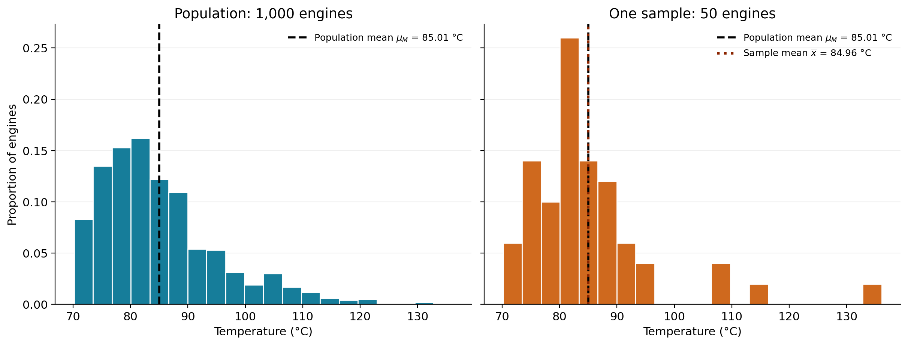
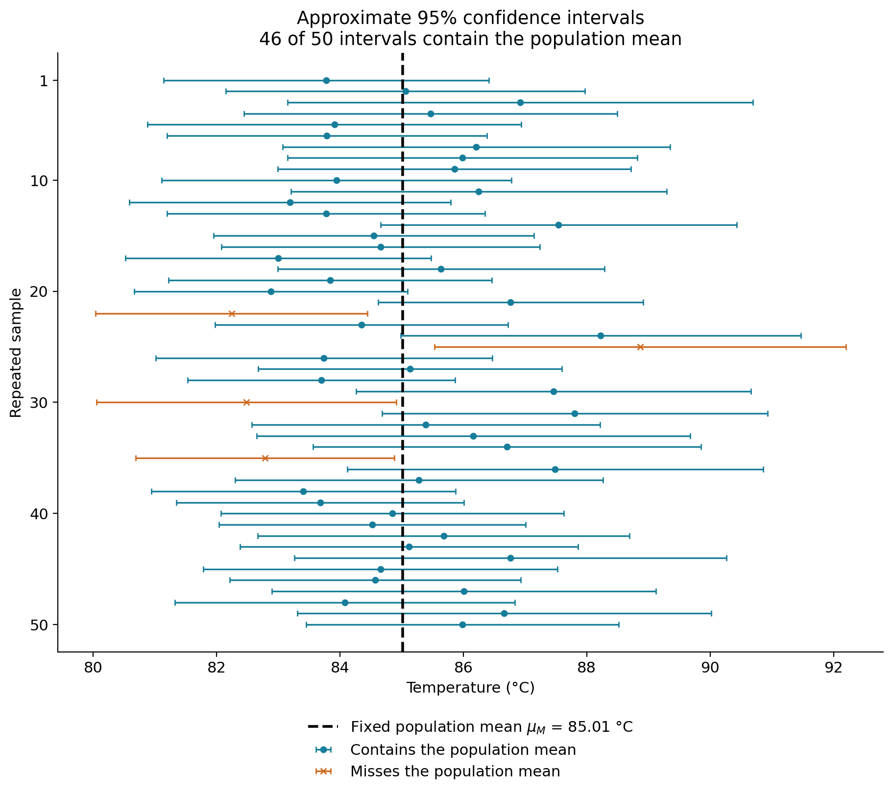

# Lecture 9 - Frequentist Uncertainty and Hypotheses Testing (I/II)

In prior lectures, we have established a frequentist perspective towards paramater learning. In this lecturer, we deepen the classical frequentist perspective, with a focus on sampling statistics and hypotheses testing. Specifically, we focus on statistical decision theory for a special case where we might want to reject or accept a hypotheses for a population, given a finite number of sample data at hand. So some of this lecture draws upon concepts introduced in lectures of week 2, where we establish the notion of the sampling space $\Omega$.

Thus, before we discuss the details of hypotheses testing, it is important to understand the mathematical foundations of **finite** sampling through the frequentist lens:

Thus, the guiding question for this lecture is:

> How can a random sample provide a reliable estimate of an unknown population quantity, and how can we quantify the uncertainty in that estimate?

This lecture will be guided by the following learning objectives.

## Learning objectives

After completing this lecture, you should be able to:

1. Distinguish finite-population and model-based sampling, including sampling with and without replacement.
2. Explain sampling distributions and why the sample mean is a random estimator.
3. Derive the expectation and standard error of the sample mean, including the finite-population correction.
4. Construct and interpret confidence intervals for a population mean using an appropriate normal approximation.
5. Use simulation to investigate sampling variability, sample-size effects, and confidence-interval coverage.

## 1. From point estimation to uncertainty

In prior lectures, we treated model parameters as fixed but unknown and derived estimators from the likelihood. For example, the Gaussian maximum-likelihood estimator of the population mean is the sample mean:

$$
\widehat{\mu}_{\mathrm{ML}}=\overline{X}.
$$

Before the sample is observed, $\overline{X}$ is a random variable. After observing the particular data values $x_1,\ldots,x_N$, we obtain the numerical estimate

$$
\widehat{\mu}_{\mathrm{ML}}=\overline{x}
=\frac{1}{N}\sum_{i=1}^{N}x_i.
$$

A different random sample would generally produce a different estimate. If repeated samples produced

$$
\overline{X}^{(1)},\overline{X}^{(2)},\ldots,\overline{X}^{(R)},
$$

our central question would be:

> How widely do these estimates vary around the true population mean $\mu$?

This question moves us from **point estimation** to **sampling** and **uncertainty**.

## 2. Population, samples, and and random sampling
In frequentist statistics, the term *population* is a very widely used.

The word *population* is used in two related ways in statistics, namely in a finite-population setting and a model-based formulation. We begin with the finite-population setting because it makes random sampling concrete.

### 2.1 Finite population

Suppose a fleet contains $M=1{,}000$ engines. For each engine $j=1,\ldots,M$, let $z_j$ denote its temperature during a specified test.

The engines are the **population units**, and $z_1,\ldots,z_M$ are their associated measurements. Different engines may have the same temperature.

For this sampling problem, we treat these measurements as fixed. We want to learn about the complete population by inspecting a randomly selected sample of engines.

Suppose we select $N=50$ distinct engines from the fleet. Then $M=1{,}000$ is the population size and $N=50$ is the sample size.

The population values remain fixed. Randomness enters through which engines are selected: different samples can contain different temperatures and therefore produce different estimates.



*Left: This histogram shows all 1,000 temperatures in our simulated population. The dashed line marks the population mean. We display the complete population for illustration; Right side: In practice, we would usually observe only the selected sample. You would than calculate sample statistic. In this case the population mean is 85.01 °C and the sample mean is 84.96 °C. So there is an estimation error (sample − population): -0.05 °C. *

So keep in mind that:

- $M$ is the number of units in the population; 
- $N$ is the number of units selected for the sample.

:::{important}
There are only two quantities here. Some statistics texts, including Rice (2007) (see references), use $N$ for population size and $n$ for sample size. In this course, we use $M$ for finite-population size and retain $N$ for sample size to remain consistent with Lecture 7. The difference is purely notational. What is important that you need to clearly define what your population statistic is as that impacts your inference.
:::

| Concept | Notation in this course  |
|---|---:|
| Finite-population size | $M$ |
| Sample size | $N$|
| Example | $M=1{,}000$, $N=50$ |


A finite-population sample selects N units from M existing units. By contrast, the model-based formulation used in machine learning more broadly treats observations as draws from a probability distribution. We introduce this distinction  later.

### 2.2 Finite-population parameters

A population parameter is a numerical characteristic of the complete population. Because the engine temperatures $z_1,\ldots,z_M$ are treated as fixed, their population parameters are also fixed.

The **population mean** is the average temperature:

$$
\mu_M=\frac{1}{M}\sum_{j=1}^{M}z_j.
$$

The **population variance** measures the spread of the individual temperatures around this mean:

$$
\sigma_M^2
=\frac{1}{M}\sum_{j=1}^{M}(z_j-\mu_M)^2.
$$

The denominator is $M$ because this definition uses all $M$ population values.

The **population standard deviation** is

$$
\sigma_M=\sqrt{\sigma_M^2}.
$$

It has the same units as the measurements: degrees Celsius in our example. The variance has units of degrees Celsius squared.

In our simulated example, we know the complete population and can calculate these parameters directly. In practice, the population parameters are usually unknown because we observe only a sample.

:::{important}
The population standard deviation describes variation among individual engines. It does not describe how much a sample mean varies across samples. That second quantity is the standard error, which we introduce later.
::: 

### 2.3 Simple random sampling without replacement

A **simple random sample without replacement** of size $N$ selects $N$ distinct population units so that every possible subset of that size has the same probability of selection.

There are

$$
\binom{M}{N}
$$

possible subsets. Therefore,

$$
P(\text{selecting a particular subset})
=\frac{1}{\binom{M}{N}}.
$$

For our fleet, this means selecting 50 distinct engines from 1,000. One way to obtain such a sample is to select each successive engine uniformly from those not yet selected.

**Without replacement** means that an engine cannot appear twice in the same sample. Different selected engines can nevertheless have identical temperatures.

Let $X_i$ denote the temperature obtained on the $i$th selection. Before selection, $X_i$ is random because we do not know which engine will be selected. After selection, we observe a particular value $x_i$.

The selections are dependent: selecting one engine changes which engines remain available. This dependence affects the variance of the sample mean, but the sample mean remains unbiased:

$$
\mathbb{E}[\overline{X}]=\mu_M.
$$

We will derive this result and the corresponding variance later.

:::{note}
Unbiasedness concerns the average over repeated samples. It does not require the mean of any one sample to equal the population mean.
:::

For comparison, **independent sampling with replacement** returns each selected engine to the pool before the next selection. Every selection again chooses uniformly from all $M$ engines, so an engine may appear more than once. The resulting observations are independent and identically distributed.

Comparing these two procedures will help us understand the finite-population correction.


### 2.4 Connection to Week 4: Model-based populations

In Week 4, we represented observations using a probability model $p(x\mid\theta)$, with fixed but unknown parameters $\theta$. Under an IID sampling model,

$$
X_1,\ldots,X_N \overset{\mathrm{iid}}{\sim}p(x\mid\theta).
$$

Here, the population is described by a probability distribution, rather than by a specified list of $M$ fixed measurements. Its mean and variance are

$$
\mu=\mathbb{E}[X],
\qquad
\sigma^2=\operatorname{Var}(X),
$$

provided these quantities exist.

The two perspectives answer related but different questions:

| Perspective | Quantity of interest | Source of randomness |
|---|---|---|
| Finite population | A characteristic of the fixed values $z_1,\ldots,z_M$ | Which population units are selected |
| Model-based population | A characteristic of $p(x\mid\theta)$ | Observations generated under the model |

Both perspectives produce random estimators and sampling distributions. However, their assumptions determine which variance and standard-error formulas apply.

A model-based formulation does not automatically imply independence. IID is an additional assumption of the particular model.

In this lecture, finite-population sampling is our main setting. We use independent sampling with replacement as a comparison and return to the model-based perspective when connecting these results to the estimation methods introduced in Week 4.


## 3. Statistics and sampling distributions

Let

$$
T=T(X_1,\ldots,X_N)
$$

be a statistic. A statistic is any function of the observed data that does not depend on unknown parameters. Before observing the data, $T$ is a random variable.

The **sampling distribution** of $T$ is the probability distribution induced by repeatedly applying $T$ to samples generated by the same sampling process.

For the sample mean,

$$
\overline{X}=\frac{1}{N}\sum_{i=1}^{N}X_i.
$$

Hypothetical repeated sampling produces

$$
\overline{X}^{(1)},\overline{X}^{(2)},\ldots .
$$

The distribution of these possible values is the sampling distribution of $\overline{X}$.

### Three distributions to distinguish

| Distribution | What is distributed? | Example |
|---|---|---|
| Population distribution | Possible individual observations $X$ | Engine temperatures generated by $p(x\mid\theta)$ |
| Empirical sample distribution | The observed values $x_1,\ldots,x_N$ | A histogram of the measured temperatures |
| Sampling distribution | Values of a statistic across repeated samples | A histogram of repeated sample means $\overline{X}^{(r)}$ |

:::{warning}
The sampling distribution of $\overline{X}$ is not the same as the distribution of the individual observations $X_i$. It describes the behavior of an estimator over hypothetical repetitions of the sampling process.
:::

## 4. The sample mean $\overline{X}$ as a random estimator

We first derive the sample statistics (e.g. the mean) and their properties under IID sampling. Section 5 then adapts the variance formula to sampling without replacement where the IID assumption is violated (based on the fleet example above).


### 4.1 Relation to Lecture 7 and frequentist parameter estimation. 

Let us return to the model-based IID setting from Lecture 7 to clarify the connection:

$$
X_1,\ldots,X_N
\overset{\mathrm{iid}}{\sim}p(x\mid\theta),
$$

with

$$
\mathbb{E}[X_i]=\mu,
\qquad
\operatorname{Var}(X_i)=\sigma^2<\infty.
$$

Here $\mu$ and $\sigma^2$ describe the population distribution. In the finite-population setting from Section 2, the analogous quantities are $\mu_M$ and $\sigma_M^2$.

We return to finite-population sampling without replacement in Section 5.

### 4.2 Expected value of $\overline{X}$

The sample mean is

$$
\overline{X}=\frac{1}{N}\sum_{i=1}^{N}X_i.
$$

Using linearity of expectation,

$$
\begin{aligned}
\mathbb{E}[\overline{X}]
&=\mathbb{E}\left[\frac{1}{N}\sum_{i=1}^{N}X_i\right]\\
&=\frac{1}{N}\sum_{i=1}^{N}\mathbb{E}[X_i]\\
&=\frac{1}{N}\sum_{i=1}^{N}\mu\\
&=\mu.
\end{aligned}
$$

Therefore,

$$
\mathbb{E}[\overline{X}]=\mu,
$$

which means that $\overline{X}$ is an **unbiased estimator** of $\mu$.

:::{note}
Unbiasedness does not mean that the estimate from one sample equals the population parameter. It means that the estimator is correct *on average over repeated samples*.
:::
### 4.3 Variance and standard error of $\overline{X}$

Assume the observations are independent and

$$
\operatorname{Var}(X_i)=\sigma^2.
$$

Then

$$
\begin{aligned}
\operatorname{Var}(\overline{X})
&=\operatorname{Var}\left(\frac{1}{N}\sum_{i=1}^{N}X_i\right)\\
&=\frac{1}{N^2}\sum_{i=1}^{N}\operatorname{Var}(X_i)\\
&=\frac{1}{N^2}N\sigma^2\\
&=\frac{\sigma^2}{N}.
\end{aligned}
$$

Thus,

$$
\operatorname{Var}(\overline{X})=\frac{\sigma^2}{N}
$$

and

$$
\operatorname{SD}(\overline{X})=\frac{\sigma}{\sqrt{N}}.
$$

The standard deviation of an estimator's sampling distribution is called its **standard error**. Under IID sampling, the standard error of the sample mean is

$$
\operatorname{SE}(\overline{X})=\frac{\sigma}{\sqrt{N}}.
$$
### 4.4 What sample size does: the $1/\sqrt(N)$ rule

Uncertainty decreases at the rate $1/\sqrt{N}$, not $1/N$. Therefore, halving the standard error requires four times as many independent observations.

This is an important practical result when designing experiments or deciding how much data to collect.

### 4.5 Sample variance and estimated standard error under IID sampling

Section 4 used the population standard deviation $\sigma$. In practice, $\sigma$ is usually unknown, so we estimate the variability of individual observations from the same sample:

$$
S^2
=\frac{1}{N-1}\sum_{i=1}^{N}(X_i-\overline{X})^2,
\qquad
S=\sqrt{S^2}.
$$

For now, read $S$ as the sample's estimate of the spread of individual observations. Then the estimated standard error of the sample mean is

$$
\widehat{\operatorname{SE}}(\overline{X})
=\frac{S}{\sqrt{N}}.
$$

It is important to distinguish

$$
S
\quad \text{from} \quad
\frac{S}{\sqrt{N}}.
$$

- $S$ estimates the variability of individual observations.
- $S/\sqrt{N}$ estimates the variability of the sample mean across repeated samples.

The latter should not be called the standard deviation of the data. It is the **estimated standard deviation of the estimator's sampling distribution**.

The denominator $N-1$ will be explained after we introduce confidence intervals with unknown variance.

## 5. Finite-population correction

### 5.1 Correction method when IDD assumption is violated 

The IID formula $\sigma/\sqrt{N}$ applies naturally to independent sampling, including sampling with replacement. When sampling without replacement from a finite population, the observations are dependent and uncertainty decreases slightly faster. We will discuss this next (A full derivation can be found in Rice (2007) see references below)

Let us define the finite-population variance using denominator $M$:

$$
\sigma_M^2
=\frac{1}{M}\sum_{j=1}^{M}(z_j-\mu_M)^2.
$$

For a simple random sample of size $N$ drawn without replacement from $M$ units,

$$
\operatorname{Var}(\overline{X})
=\frac{\sigma_M^2}{N}\frac{M-N}{M-1},
$$

and hence

$$
\operatorname{SE}(\overline{X})
=\frac{\sigma_M}{\sqrt{N}}
\sqrt{\frac{M-N}{M-1}}.
$$

The term

$$
\sqrt{\frac{M-N}{M-1}}
$$

is the **finite-population correction** under this definition of $\sigma_M^2$.

The correction has an intuitive interpretation:

- if $N=1$, the correction equals $1$;
- if $N=M$, the correction equals $0$ because observing the entire population eliminates sampling uncertainty;
- if $N/M$ is very small, the correction is close to $1$ and the IID standard-error formula is a good approximation.

### 5.2 Estimating the standard error from one sample

Usually, we cannot calculate the population standard deviation $\sigma_M$ (e.g. in the case of our fleet we do not know all the fleet temperatures). 
Instead, we calculate the sample standard deviation $s$ from the samples we observe (e.g. the selected engines), using the denominator $N-1$.

For simple random sampling without replacement, the estimated standard error is

$$
\widehat{\operatorname{SE}}(\overline{X})
=\frac{s}{\sqrt{N}}\sqrt{1-\frac{N}{M}}.
$$

In Section 4.5, we defined the sample standard deviation $S$. Before collecting data, $S$ is a random variable: its value depends on which observations enter the sample. After observing a particular sample, we write its calculated value as lowercase $s$.

This follows the same convention as $\overline{X}$ for the random sample mean and $\overline{x}$ for its observed value:

$$
S=\sqrt{\frac{1}{N-1}\sum_{i=1}^{N}(X_i-\overline{X})^2}
\qquad\longrightarrow\qquad
s=\sqrt{\frac{1}{N-1}\sum_{i=1}^{N}(x_i-\overline{x})^2}.
$$

For example, before selecting 50 engines, $S$ is unknown and varies across possible samples. After measuring the selected engines, we might calculate $s=10$ °C.
The lowercase $s$ is the numerical sample standard deviation calculated from the observed data.

For example, if $M=1000$, $N=50$, and $s=10$ °C, then

$$
\widehat{\operatorname{SE}}(\overline{X})
=\frac{10}{\sqrt{50}}\sqrt{1-\frac{50}{1000}}
\approx 1.38\text{ °C}.
$$

The sample standard deviation of 10 °C describes variation among individual engine temperatures. The estimated standard error of 1.38 °C describes variation of sample means across repeated samples.

Notice that the formula using $s$ contains $\sqrt{1-N/M}$. The earlier formula using $\sigma_M$ contains $\sqrt{(M-N)/(M-1)}$. These differ because the sample variance and our population variance use different denominators.

## 6. Normal approximation and the central limit theorem

We first briefly state the classical central limit theorem for IID observations. Sampling without replacement requires a corresponding finite-population normal approximation ,using the standard error from Section 5.

Suppose

$$
X_1,\ldots,X_N\overset{\mathrm{iid}}{\sim}p(x),
$$

with

$$
\mathbb{E}[X_i]=\mu,
\qquad
\operatorname{Var}(X_i)=\sigma^2<\infty.
$$

The central limit theorem states that

$$
\frac{\overline{X}-\mu}{\sigma/\sqrt{N}}
\xrightarrow{d}\mathcal{N}(0,1)
\qquad \text{as } N\to\infty.
$$

Consequently, for sufficiently large $N$,

$$
\overline{X}
\overset{\cdot}{\sim}
\mathcal{N}\left(\mu,\frac{\sigma^2}{N}\right),
$$

where $\overset{\cdot}{\sim}$ denotes an approximate distribution.

### 6.1 Exact Gaussian case

If

$$
X_i\sim\mathcal{N}(\mu,\sigma^2),
$$

then

$$
\overline{X}\sim
\mathcal{N}\left(\mu,\frac{\sigma^2}{N}\right)
$$

exactly for every sample size $N$.

### 6.2 Non-Gaussian case

If the population distribution is not Gaussian, normality of the sample mean is generally an approximation. How large $N$ must be depends on features such as skewness, heavy tails, outliers, and dependence.

### 6.3 What the CLT does not guarantee

The CLT does not imply that:

- individual observations are Gaussian;
- every sample of size $30$ is sufficiently large;
- dependence can be ignored;
- biased sampling becomes valid as $N$ grows; or
- strong time-series correlation disappears merely because many observations were recorded.

## 7. Confidence interval 

### 7.1 Confidence intervals when the variance is known

We first consider IID observations. If $\sigma$ is known, the standardized sample mean below follows a standard Gaussian. distribution exactly when the observations are Gaussian,and approximately when a normal approximation is adequate.

$$
Z
=\frac{\overline{X}-\mu}{\sigma/\sqrt{N}}
\approx\mathcal{N}(0,1).
$$

Let $z_{1-\alpha/2}$ denote the $(1-\alpha/2)$ quantile of the standard normal distribution. Then

$$
P\left(
-z_{1-\alpha/2}
\leq
\frac{\overline{X}-\mu}{\sigma/\sqrt{N}}
\leq
z_{1-\alpha/2}
\right)
\approx 1-\alpha.
$$

Rearranging gives the random interval

$$
\overline{X}
\pm
z_{1-\alpha/2}\frac{\sigma}{\sqrt{N}}.
$$

After observing the data, the corresponding interval is

$$
\overline{x}
\pm
z_{1-\alpha/2}\frac{\sigma}{\sqrt{N}}.
$$

For a $95\%$ confidence interval,

$$
z_{0.975}\approx 1.96.
$$

### 7.2 Confidence interval when the variance is unknown

When $\sigma$ is unknown, replace it with the sample standard deviation $S$ and define

$$
T
=\frac{\overline{X}-\mu}{S/\sqrt{N}}.
$$

For IID Gaussian observations,

$$
T\sim t_{N-1}.
$$

The exact confidence interval is then

$$
\overline{x}
\pm
t_{N-1,\,1-\alpha/2}\frac{s}{\sqrt{N}},
$$

where $t_{N-1,\,1-\alpha/2}$ is the appropriate quantile of the Student $t$ distribution with $N-1$ degrees of freedom.

Three ideas are important:

1. replacing $\sigma$ with $S$ introduces additional uncertainty;
2. the $t$ distribution has heavier tails than the standard normal distribution; and
3. the $t$ distribution approaches the standard normal distribution as $N$ increases.

> Connection to Lecture 7: why does sample variance use $N-1$?

Lecture 7 derived the Gaussian maximum-likelihood estimator of the variance:

$$
\widehat{\sigma}_{\mathrm{ML}}^2
=\frac{1}{N}\sum_{i=1}^{N}(X_i-\overline{X})^2.
$$

Under the IID model, the unbiased estimator of the population variance is:

$$
S^2
=\frac{1}{N-1}\sum_{i=1}^{N}(X_i-\overline{X})^2.
$$

These formulas are not contradictory. They answer different questions:

| Estimator | Denominator | Main property |
|---|---:|---|
| Gaussian MLE | $N$ | Maximizes the Gaussian likelihood |
| Sample variance $S^2$ | $N-1$ | Has expectation $\sigma^2$ under the IID model |

The denominator $N-1$ appears because the deviations are computed from the sample mean $\overline{X}$, not from the unknown population mean $\mu$. These deviations must satisfy

$$
\sum_{i=1}^{N}(X_i-\overline{X})=0.
$$

Once $N-1$ deviations are known, the final deviation is determined by this constraint. Only $N-1$ deviations are free to vary; we say that the residuals have $N-1$ **degrees of freedom**.

For IID Gaussian observations, the MLE is biased downward at finite $N$:

$$
\mathbb{E}\left[\widehat{\sigma}_{\mathrm{ML}}^2\right]
=\frac{N-1}{N}\sigma^2,
$$

whereas

$$
\mathbb{E}[S^2]=\sigma^2.
$$

## 7.3.  Correct interpretation of a confidence interval

Before observing the sample,

$$
[L(X),U(X)]
$$

is a random interval. A $100(1-\alpha)\%$ confidence procedure satisfies

$$
P_{\theta}\bigl(L(X)\leq\theta\leq U(X)\bigr)
=1-\alpha,
$$

or approximately $1-\alpha$ when the procedure relies on an approximation.

After observing the sample,

$$
[L(x),U(x)]
$$

is fixed.

We now return to the fixed fleet. Each sample contains $N=50$ engines selected without replacement from $M=1000$ engines. For each sample, we calculate an approximate 95% confidence interval for the fleet mean:

$$
\overline{x}\pm1.96\,
\frac{s}{\sqrt{N}}\sqrt{1-\frac{N}{M}}.
$$

This uses the estimated standard error from Section 5.1 and assumes that a normal approximation is adequate.

Each confidence interval is centered on its own sample mean, so it always contains that sample mean. What we investigate is whethe also contains the fixed population mean $\mu_M$.

**What does the 95% confidence interval mean?**
Imagine repeatedly inspecting 50 engines from the same fixed fleet. Each time, we calculate a sample mean and an approximate 95% confidence interval. The population mean stays fixed, but the selected engines—and therefore the interval—change. The figure shows this experiment repeated 50 times. Each horizontal interval comes from a separate sample. The dashed vertical line marks the true fleet mean, which we know because this is a simulation.



Intervals that cross the dashed line contain the population mean; orange intervals do not. We should not expect exactly 95% coverage in just 50 repetitions. A 95% confidence interval for the mean does not describe where 95% of engine temperatures lie. It comes from a procedure that, across repeated samples, produces intervals containing the fixed fleet mean approximately 95% of the time.

In practice, we usually observe only one sample and construct one interval. Because the population mean is unknown, we cannot tell whether that particular interval contains it.

:::{important}
A correct frequentist interpretation is:

> If the sampling and interval-construction procedure were repeated many times, approximately $100(1-\alpha)\%$ of the resulting intervals would contain the true parameter, provided the assumptions hold.
:::

It is not technically correct in the frequentist framework to say that the fixed parameter has a $95\%$ probability of lying in the particular interval already observed.

## 8 Assumptions recap: 

The formulas in this lecture assume, explicitly or implicitly:

- representative random sampling;
- independence or suitably weak dependence;
- a stable data-generating distribution;
- finite variance for the standard central limit theorem;
- an adequate normal approximation; and
- correct identification of the sampling unit.

### Physical-system example: dependence in sensor data

Suppose a system records one engine-temperature value every second for $10{,}000$ seconds. This does not necessarily provide $10{,}000$ independent observations. Adjacent temperatures may be strongly autocorrelated.

If positive correlation is ignored,

$$
\widehat{\operatorname{SE}}(\overline{X})
=\frac{S}{\sqrt{N}}
$$

may substantially underestimate uncertainty. More data points do not automatically provide more independent information.

This is particularly important for time-series, robotics, autonomous-system, and industrial sensor data.


## Practice Problems and Solutions

Attempt each problem before opening its solution. A calculator is sufficient; no programming is required.

### 1. Population parameters and one observed estimate

A fixed population contains four engines with temperatures

$$
70,\quad 80,\quad 90,\quad 100\text{ °C}.
$$

1. Calculate the population mean $\mu_M$.
2. Calculate the population variance $\sigma_M^2$, using denominator $M$.
3. Calculate the population standard deviation.
4. A sample contains the engines with temperatures 70 and 80 °C. Calculate its mean and estimation error $\overline{x}-\mu_M$.
5. Does this error demonstrate that the sample mean is a biased estimator?

```{admonition} Solution
:class: dropdown

The population size is $M=4$, and

$$
\mu_M=\frac{70+80+90+100}{4}=85\text{ °C}.
$$

The deviations from the population mean are $-15,-5,5,15$, so

$$
\sigma_M^2
=\frac{225+25+25+225}{4}
=125\text{ °C}^2.
$$

Therefore,

$$
\sigma_M=\sqrt{125}\approx11.18\text{ °C}.
$$

For the selected sample,

$$
\overline{x}=\frac{70+80}{2}=75\text{ °C},
$$

and the estimation error is

$$
\overline{x}-\mu_M=75-85=-10\text{ °C}.
$$

This is the error of one observed estimate. Bias concerns the expected error across repeated samples, so this calculation alone does not establish bias.
```

### 2. Construct an exact sampling distribution

Use the four-engine population from Problem 1. Select $N=2$ distinct engines by simple random sampling without replacement.

1. List all possible unordered samples and their means.
2. Find the probability of each possible sample mean.
3. Calculate $\mathbb{E}[\overline{X}]$.
4. Calculate $\operatorname{Var}(\overline{X})$ and the standard error.

```{admonition} Solution
:class: dropdown

There are $\binom{4}{2}=6$ equally likely samples:

| Sample temperatures (°C) | Sample mean (°C) |
|---|---:|
| 70, 80 | 75 |
| 70, 90 | 80 |
| 70, 100 | 85 |
| 80, 90 | 85 |
| 80, 100 | 90 |
| 90, 100 | 95 |

The pairs are equally likely, but the distinct mean values are not:

| $\overline{X}$ | 75 | 80 | 85 | 90 | 95 |
|---|---:|---:|---:|---:|---:|
| Probability | $1/6$ | $1/6$ | $2/6$ | $1/6$ | $1/6$ |

Thus,

$$
\mathbb{E}[\overline{X}]
=\frac{75+80+85+85+90+95}{6}
=85\text{ °C}.
$$

The expected sample mean equals $\mu_M$, demonstrating unbiasedness.

The variance is

$$
\operatorname{Var}(\overline{X})
=\frac{(-10)^2+(-5)^2+0^2+0^2+5^2+10^2}{6}
=\frac{125}{3}
\approx41.67\text{ °C}^2.
$$

Therefore,

$$
\operatorname{SE}(\overline{X})
=\sqrt{\frac{125}{3}}
\approx6.45\text{ °C}.
$$

This is the spread of sample means, not the spread of individual engine temperatures.
```

### 3. Compare sampling with and without replacement

For the same population, $\sigma_M^2=125$ and $M=4$.

1. Calculate the standard error for two independent selections with replacement.
2. Calculate it for two selections without replacement.
3. What happens if we select all four engines without replacement?
4. Would four selections with replacement also eliminate uncertainty?

```{admonition} Solution
:class: dropdown

With replacement, the selections are independent:

$$
\operatorname{SE}(\overline{X})
=\frac{\sigma_M}{\sqrt{N}}
=\sqrt{\frac{125}{2}}
\approx7.91\text{ °C}.
$$

Without replacement,

$$
\operatorname{SE}(\overline{X})
=\sqrt{\frac{125}{2}}
\sqrt{\frac{4-2}{4-1}}
=\sqrt{\frac{125}{3}}
\approx6.45\text{ °C}.
$$

This agrees with the exact enumeration in Problem 2.

If $N=M=4$ without replacement, every engine is observed:

$$
\operatorname{SE}(\overline{X})=0.
$$

Four selections with replacement can include repeated engines and omit others. Their standard error is

$$
\operatorname{SE}(\overline{X})
=\sqrt{\frac{125}{4}}
\approx5.59\text{ °C}.
$$

Observing the entire population eliminates sampling uncertainty; making the same number of draws with replacement does not.
```

### 4. Estimate standard error from one sample

From the four-engine population, suppose the selected sample contains temperatures 70 and 90 °C.

1. Calculate $\overline{x}$.
2. Calculate the sample variance

   $$
   s^2=\frac{1}{N-1}\sum_{i=1}^{N}(x_i-\overline{x})^2.
   $$

3. Calculate the estimated finite-population standard error

   $$
   \widehat{\operatorname{SE}}(\overline{X})
   =\frac{s}{\sqrt{N}}\sqrt{1-\frac{N}{M}}.
   $$

4. Why need this estimate not equal the exact standard error from Problem 2?

```{admonition} Solution
:class: dropdown

The sample mean is

$$
\overline{x}=\frac{70+90}{2}=80\text{ °C}.
$$

With $N=2$,

$$
s^2
=\frac{(70-80)^2+(90-80)^2}{2-1}
=200\text{ °C}^2.
$$

Therefore,

$$
\widehat{\operatorname{SE}}(\overline{X})
=\frac{\sqrt{200}}{\sqrt{2}}
\sqrt{1-\frac{2}{4}}
=\sqrt{50}
\approx7.07\text{ °C}.
$$

The exact standard error is approximately 6.45 °C. Our estimate uses only two observed temperatures, so it varies with the selected sample.

Notice that the estimated-standard-error formula uses $\sqrt{1-N/M}$ with $s$. The formula using the known population standard deviation $\sigma_M$ uses $\sqrt{(M-N)/(M-1)}$.
```

### 5. Calculate an approximate confidence interval

A simple random sample of $N=50$ engines is selected without replacement from a fleet of $M=1{,}000$ engines.

The observed sample has

$$
\overline{x}=84\text{ °C},
\qquad
s=10\text{ °C}.
$$

Assume a normal approximation is adequate.

1. Calculate the estimated standard error, including the finite-population correction.
2. Calculate an approximate 95% confidence interval using 1.96 as the critical value.
3. Explain what the interval estimates.

```{admonition} Solution
:class: dropdown

The estimated standard error is

$$
\widehat{\operatorname{SE}}(\overline{X})
=\frac{10}{\sqrt{50}}
\sqrt{1-\frac{50}{1000}}
=\sqrt{1.9}
\approx1.378\text{ °C}.
$$

The margin of error is

$$
1.96(1.378)\approx2.702\text{ °C}.
$$

The interval is therefore

$$
84\pm2.702,
$$

or approximately

$$
[81.30,\;86.70]\text{ °C}.
$$

This interval estimates the mean temperature of the fixed fleet. It is not an interval intended to contain 95% of individual engine temperatures.

Its nominal coverage is approximately 95%, subject to the sampling assumptions and adequacy of the normal approximation.
```

### 6. Interpret confidence intervals and population means

Explain what is incorrect or incomplete in each statement.

1. “This observed 95% confidence interval gives the fixed population mean a 95% probability of being inside it.”
2. “Exactly 95 of every 100 intervals constructed by a 95% confidence procedure must contain the population mean.”
3. “If we measure all 1,000 engines, we know both the mean of this fleet and the mean of the broader process that generated its temperatures.”

```{admonition} Solution
:class: dropdown

**1.** In the frequentist interpretation, the population mean is fixed. After observation, the interval is also fixed and either contains that mean or does not.

The confidence level describes the procedure's coverage across repeated samples.

**2.** Coverage is a long-run property, not a requirement for every batch of 100 intervals. The observed fraction varies across batches. For an approximate procedure, its actual long-run coverage may also differ from the nominal 95%.

**3.** Measuring every engine determines this fleet's mean exactly, assuming accurate measurements. It does not generally determine the mean of a broader data-generating process exactly.
```

The finite-population mean $\mu_M$ and a model's mean $\mu=\mathbb{E}[X]$ are different targets.

## 13. Coding experiments to build intuitaion: making repeated sampling visible

### Experiment 1: Sampling distribution of the mean

For a known population distribution:

1. draw $R$ independent samples of size $N$;
2. compute the mean of each sample;
3. plot the resulting sample means;
4. compare their empirical mean with $\mu$; and
5. compare their empirical standard deviation with $\sigma/\sqrt{N}$.

### Experiment 2: Effect of sample size

Use

$$
N\in\{5,30,100,500\}.
$$

Verify empirically that standard error decreases approximately as

$$
\frac{1}{\sqrt{N}}.
$$

### Experiment 3: Central limit theorem

Repeat the simulation using a skewed exponential population. Show that the population distribution remains skewed while the sampling distribution of $\overline{X}$ becomes increasingly Gaussian as $N$ grows.

### Experiment 4: Confidence-interval coverage

Construct a $95\%$ confidence interval for each simulated sample and compute the proportion of intervals that contain $\mu$. The empirical coverage should be close to

$$
0.95.
$$

### Experiment 5: Finite sampling without replacement

Create a fixed finite population of size $M$. Repeatedly draw simple random samples of size $N$ without replacement. Compare:

1. the empirical standard deviation of the sample means;
2. the IID approximation $\sigma_M/\sqrt{N}$; and
3. the finite-population result

$$
\frac{\sigma_M}{\sqrt{N}}
\sqrt{\frac{M-N}{M-1}}.
$$

Repeat for several sampling fractions $N/M$.

### Experiment 6: Dependence

Generate an autocorrelated sequence and incorrectly treat its observations as IID. Compare nominal confidence-interval coverage with empirical coverage. This experiment illustrates why independence assumptions matter for industrial and physical-system data.

## References and supplementary resources

- John A. Rice (2007) [*Mathematical Statistics and Data Analysis*, especially Sections 5.3 and 7.2–7.3. ](https://korivernon.com/documents/MathematicalStatisticsandDataAnalysis3ed.pdf)
- Steven L. Brunton, [Population Statistics and Random Sampling](https://www.youtube.com/watch?v=OlkL1YatyHI).
- Steven L. Brunton, [Expected Value and Variance of the Sample Mean](https://www.youtube.com/watch?v=Gg3d-rn9eEU).
- Steven L. Brunton, [Random Sampling Without Replacement](https://www.youtube.com/watch?v=IDvp3pMm16k).
- Steven L. Brunton, [Sample Variance in Random Population Sampling](https://www.youtube.com/watch?v=yNnUVHfX5yQ).
- Steven L. Brunton, [Normal Approximation to the Sample Mean](https://www.youtube.com/watch?v=Arbj9SoU9Cs).
- Steven L. Brunton, [Confidence Intervals](https://www.youtube.com/watch?v=qTVdV8ITZfk).

## 14. Bridge to Lecture 10: hypothesis testing

Suppose someone proposes that

$$
\mu=\mu_0.
$$

Under this proposal and an appropriate normal approximation,

$$
\overline{X}
\approx
\mathcal{N}\left(\mu_0,\frac{\sigma^2}{N}\right).
$$

We can therefore ask:

> Is the observed sample mean reasonably compatible with this proposed sampling distribution, or is it unusually far into its tails?

We will discuss this in the next lecture.

