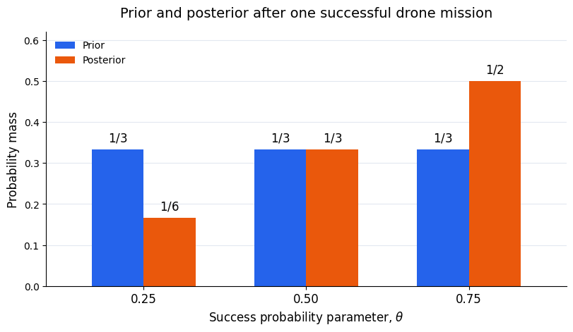
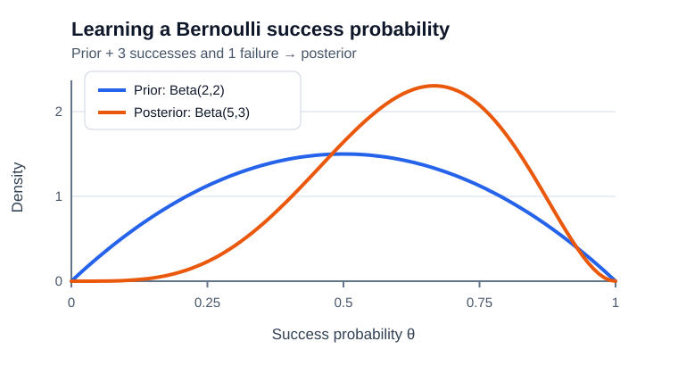

# Lecture 13 - Bayesian Inference Foundations

Lecture 7 estimated an unknown parameter by choosing a single value that maximized the likelihood following the frequenciest approach. 

In lecture 9, we made an assumptions grounded in a frequentist perspective: We assumed that a sample's parameters can approximate the true populations' parameters (or the "true underlying model of the world"). Based on this assumption we were able to quantify uncertainty with a confidence interval using test-statistics like the Z-statistics and the t-statistics. 

In Lecture 12 we showed that, for many familiar models, the likelihood depends on the sample through a small set of sufficient statistics. 

Today, we go back to an earlier discussion in lecture 3, namely the probability foundations, where we pointed to a Baysian perspective and Bayes theorem that proposes that we cannot be always be sure about whether our underlying parameter changes as we see more data. Thus,  today, we are taking a Baysian view and ask a different but related question: **How should our uncertainty about an unknown parameter change when we observe data?**

Thus, the guiding question for this lecture is:

> How can we represent uncertainty about an unknown parameter and update that uncertainty after observing data?

**So why does this matter?**
Suppose we are evaluating an engine under a specified operating condition.
During each standardized test, we record whether its maximum temperature
exceeds a chosen monitoring threshold:

$$
X=
\begin{cases}
1, & \text{if the temperature exceeds the threshold},\\
0, & \text{otherwise}.
\end{cases}
$$

Let $\theta$ denote the unknown probability of an exceedance under these
conditions.

Lecture 7 would estimate $\theta$ from the observed fraction of exceedances.
Lecture 9 would ask how that estimate varies across hypothetical repeated
datasets.

Now suppose we have prior information from earlier tests, but only a small
number of new observations. We want to ask:

> What should we believe about the exceedance probability before testing,
> how should an observed exceedance change that belief, and what should we
> predict for the next test?

These are three related questions about the **prior**, **posterior**, and
**posterior predictive distribution**.

This is just one motivating example, why you might want to adopt a Bayesian perspective, when you draw conclusions from data! 

> Thought experiment: Think about a problem in our organization or one of your ongoing research projects, where you could create a similar thought experiment? Why would that be important for data-driven decision making? 

Based on this example, we can now define the following objectives for our lecture: 

## Learning objectives

After completing this lecture, you should be able to:

1. Distinguish frequentist parameter estimation from Bayesian inference.
2. Identify and interpret the prior, likelihood, evidence, and posterior.
3. Calculate a posterior and its evidence in a simple discrete-parameter example.
4. Explain posterior prediction and distinguish credible intervals from
   confidence intervals.

## 1. From parameter estimation to parameter uncertainty

### 1.1 Connection to Lecture 7: likelihood and maximum likelihood
Let $X$ denote a random observation, $x$ its realized value, and $\mathcal D=(x_1,\ldots,x_N)$ the observed dataset. A sampling model $p(x\mid\theta)$ describes observations conditional on a parameter value.

For observations that are conditionally independent and identically distributed given $\theta$,

$$
L(\theta;\mathcal D)=p(\mathcal D\mid\theta)
=\prod_{n=1}^{N}p(x_n\mid\theta).
$$

Once the data have been observed, the likelihood is a function of $\theta$. Lecture 7 used it to choose the maximum-likelihood estimate,

$$
\widehat\theta_{\mathrm{ML}}=\operatorname*{arg\,max}_{\theta}L(\theta;\mathcal D).
$$

This returns one value. It does not, by itself, provide a probability distribution over possible parameter values.

### 1.2 Connection to Lecture 9: uncertainty across repeated samples

Before observing data, an estimator $\widehat\theta=g(\mathbf X)$ is random because the sample $\mathbf X$ is random. Lecture 9 asked how that estimator would vary if the entire data-collection procedure were repeated under the same fixed parameter.

The sampling distribution describes the behavior of an estimation procedure across possible datasets.

### 1.3 The Bayesian perspective: a distribution over an unknown parameter

In Bayesian parameter learning, a probability distribution represents uncertainty about $\theta$. Before seeing the current data, it is the **prior**, $p(\theta)$. After observing the data, it is the **posterior**, $p(\theta\mid\mathcal D)$.

The parameter is not assumed to physically change when we collect data. What changes is our distribution describing which values are plausible. A random-variable representation of the parameter expresses uncertainty about its value.

:::{admonition} Frequentist and Bayesian uncertainty
:class: important

| Perspective | Parameter | What varies in the uncertainty calculation? | Principal question |
|---|---|---|---|
| Lecture 7: maximum likelihood | Fixed but unknown | Candidate parameter values in the likelihood calculation | Which value maximizes the likelihood of this dataset? |
| Lecture 9: sampling uncertainty | Fixed but unknown | Samples and estimators across hypothetical repetitions | How would the estimator vary across samples? |
| Lecture 13: Bayesian inference | Described by a distribution representing uncertainty | Possible parameter values conditional on the observed dataset | How plausible are different values after observing these data? |

Bayesian inference conditions on the dataset actually observed. It does not require collecting repeated datasets.
:::

## 2. The ingredients of a Bayesian model

Bayes' theorem (see lecture 3) provides the foundation. We had explained it when we introduced conditional probability. 

$$
P(A \mid B) = \frac{P(B \mid A)P(A)}{P(B)}
$$

The pieces have useful names:

- $P(A)$ is the **prior** probability of $A$.
- $P(B \mid A)$ is the **likelihood** of observing evidence $B$ if $A$ is true.
- $P(B)$ is the **evidence** or normalizing probability.
- $P(A \mid B)$ is the **posterior** probability of $A$ after observing $B$.
---

You may want to go back and refresh your memory on this theorem so that this lecture is easy to follow. 

We use a working example, assuming we have Bernoulli distribution (discussed in lecture 4 in the section on discrete random variables). 

### 2.1 Observed data and the sampling model

We use a working example, assuming we have Bernoulli distribution (discussed in lecture 4 in the section on discrete random variables) to explain the principle Baysian inference. 

$$
P(X=x\mid\theta)=\theta^x(1-\theta)^{1-x},
\qquad x\in\{0,1\}.
$$

For example, $X=1$ indicates that a drone completes a mission successfully,
such as landing at the designated airport, while $X=0$ indicates that it
does not meet the specified success criterion. The parameter $\theta$
is the unknown probability of mission success under the modeled operating
conditions.

We observe mission outcomes, not $\theta$ itself. Bayesian inference lets
us update our uncertainty about $\theta$ using those observed outcomes.

### 2.2 The prior: uncertainty before observing the data

The prior represents uncertainty before incorporating the current dataset. It can reflect previous studies, domain knowledge, or explicitly stated modeling assumptions. It is not automatically an objective description of the problem.

Parameters specifying a prior are called **hyperparameters**. In these lectures, we treat them as chosen, fixed quantities. Assigning them their own priors is a further modeling step.
### 2.3 The likelihood: how the parameter explains the observed data

The likelihood describes how well proposed parameter values explain the observed data. For a particular Bernoulli sequence with $S$ successes and $F$ failures,

$$
p(\mathcal D\mid\theta)=\theta^S(1-\theta)^F.
$$

This also connects to Lecture 12: given $N=S+F$, the success count is sufficient for $\theta$. (We will return to the importance of sufficient statistics in Lecture 14). 

:::{warning}
The likelihood $L(\theta;\mathcal D)$ is not a probability distribution over $\theta$. It need not sum or integrate to one across parameter values. A prior or posterior does.
:::

### 2.4 The joint distribution of parameters and data

The prior and sampling model together define

$$
p(\theta,\mathcal D)=p(\mathcal D\mid\theta)p(\theta).
$$

This joint model is the starting point for both parameter learning and prediction.

:::{warning}
[Distinguish a likelihood function from a probability distribution
over the parameter.]
:::

## 3. Bayes’ rule for parameter learning

### 3.1 The posterior: uncertainty after observing the data

Conditioning the joint distribution on the observed dataset gives

$$
\boxed{p(\theta\mid\mathcal D)
=\frac{p(\mathcal D\mid\theta)p(\theta)}{p(\mathcal D)}}.
$$

The numerator combines the prior with the likelihood. A value receives appreciable posterior probability only if their product is appreciable relative to the products for other values.
### 3.2 The evidence: normalizing the posterior

For a discrete parameter taking values $\theta_1,\ldots,\theta_K$,

$$
p(\mathcal D)=\sum_{k=1}^{K}p(\mathcal D\mid\theta_k)P(\theta=\theta_k).
$$

For a continuous parameter, the corresponding expression is

$$
p(\mathcal D)=\int p(\mathcal D\mid\theta)p(\theta)\,d\theta.
$$

The **evidence**, also called the marginal likelihood, averages the likelihood under the prior. It normalizes the posterior. For a fixed model and dataset, it is one number, not a function of $\theta$. With continuous observations it is a density value, which need not be less than one.

### 3.3 Posterior proportional to likelihood times prior

Because the evidence does not depend on $\theta$, we can write

$$
p(\theta\mid\mathcal D)\propto p(\mathcal D\mid\theta)p(\theta)
$$

and normalize afterward. The symbol $\propto$ means that the two expressions differ by a positive factor independent of $\theta$.

:::{admonition} Four quantities to distinguish
:class: important

| Quantity | Notation | Interpretation |
|---|---|---|
| Prior | $p(\theta)$ | Uncertainty about the parameter before the current data |
| Likelihood | $p(\mathcal D\mid\theta)$ | Fit of proposed parameter values to the observed data |
| Evidence | $p(\mathcal D)$ | Prior-averaged probability or density of the observed data |
| Posterior | $p(\theta\mid\mathcal D)$ | Uncertainty about the parameter after observing the data |
:::

## 4. Worked example: learning an unknown success probability

### 4.1 Three possible parameter values

For a deliberately simple model, suppose the success probability can take only three values:

$$
\theta\in\left\{\frac14,\frac12,\frac34\right\}.
$$

This is a discrete prior over a restricted parameter space. It is a teaching example, not an assumption that every success probability must have one of these values.

### 4.2 Assigning the prior

Assign each value prior probability $1/3$. The prior mean is $1/2$.

### 4.3 Observing one success

Observe $\mathcal D=(1)$. Since $P(X=1\mid\theta)=\theta$, the likelihood values are $1/4$, $1/2$, and $3/4$.

### 4.4 Evidence and normalized posterior

Multiply each likelihood by its prior probability and sum:

$$
P(X=1)=\frac14\frac13+\frac12\frac13+\frac34\frac13=\frac12.
$$

Divide each product by this evidence:

| Parameter value | Prior | Likelihood of success | Likelihood × prior | Posterior |
|---|---|---|---|---|
| $1/4$ | $1/3$ | $1/4$ | $1/12$ | $1/6$ |
| $1/2$ | $1/3$ | $1/2$ | $1/6$ | $1/3$ |
| $3/4$ | $1/3$ | $3/4$ | $1/4$ | $1/2$ |

The posterior probabilities add to one.

### 4.5 Interpreting the update through Bayes' rule

Consider the candidate value $\theta=3/4$.

Before observing the mission, its **prior probability** is
$P(\theta=3/4)=1/3$.

The **likelihood** of the observed data—one successful mission—given
$\theta=3/4$ is

$$
P(X=1\mid\theta=3/4)=\frac34.
$$

This means that if the mission-success probability were $3/4$, a
successful mission would occur with probability $3/4$.

The **evidence**, calculated in Section 4.4, averages the likelihood
across all three candidate values using their prior probabilities:

$$
P(X=1)=\frac12.
$$

Bayes' rule combines these quantities to obtain the **posterior probability**
of this candidate value after observing the successful mission:

$$
P(\theta=3/4\mid X=1)
=\frac{P(X=1\mid\theta=3/4)P(\theta=3/4)}{P(X=1)}
=\frac{(3/4)(1/3)}{1/2}
=\frac12.
$$

Thus, observing one success increases the probability assigned to the
candidate $\theta=3/4$ from $1/3$ (prior) to $1/2$ (posterior).
The likelihood concerns the observed mission outcome given a candidate
parameter value; the posterior concerns that candidate parameter value
given the observed mission outcome.

*Prior and posterior probability masses at $\theta=1/4$, $1/2$, and $3/4$
after one successful mission. The bars represent probabilities assigned
to candidate parameter values.*

:::{admonition} Check your understanding
:class: tip

If the observed outcome were a failure, which parameter value would have
the largest posterior probability? Explain using the likelihood
$P(X=0\mid\theta)=1-\theta$ and the equal prior probabilities.

:::

## 6. A continuous success probability: the Beta–Bernoulli example

### 6.1 From three candidate values to a continuous parameter

Section 4 restricted $\theta$ to three candidate values so that we could calculate each step of Bayes' rule using a small table. We now allow the unknown mission-success probability to take any value in $0<\theta<1$.

The observations are still binary: each mission produces $X=1$ for success or $X=0$ for failure. It is the **parameter space** that is now continuous.

We represent uncertainty about $\theta$ using a probability density. In Section 4, each bar was the probability assigned to one candidate value. Here, probability is represented by **area under a density curve** over a range of parameter values. The height of the curve at one value is a density, not the probability of that exact value. A continuous distribution assigns probability zero to any single exact value, and its density can exceed one.

The calculation retains the same structure:

$$
p(\theta\mid\mathcal D)
=\frac{p(\mathcal D\mid\theta)p(\theta)}{p(\mathcal D)}.
$$

We use densities for the prior and posterior, and an integral replaces the sum in the evidence. Because the mission outcomes remain discrete, $p(\mathcal D\mid\theta)$ and $p(\mathcal D)$ are probabilities of the observed data.

### 6.2 The prior: introducing the Beta distribution

In the discrete example, we specified our prior by assigning probabilities to three candidate values of $\theta$. Now that $\theta$ can take any value in $(0,1)$, we need a continuous prior density over that range.

Following Bishop (2006, Section 2.1.1), we use the **Beta distribution**, which we introduce here. It is a family of continuous distributions defined on $(0,1)$. Two positive shape parameters, $a$ and $b$, let us express different assumptions about the unknown success probability.

Bishop motivates this choice by looking at the Bernoulli likelihood: it contains powers of $\theta$ and $1-\theta$. A Beta prior contains these same factors. Multiplying the likelihood and prior therefore adds their exponents, making the posterior straightforward to calculate. We will see this directly in Section 6.4.

The two distributions play different roles: the **Bernoulli model describes a mission outcome** $X$, while the **Beta prior describes our uncertainty about its success probability** $\theta$.

The Beta density is

$$
p(\theta)
=\operatorname{Beta}(\theta\mid a,b)
=\frac{\theta^{a-1}(1-\theta)^{b-1}}{B(a,b)},
\qquad 0<\theta<1,\quad a,b>0.
$$

Here,

$$
B(a,b)=\int_0^1 u^{a-1}(1-u)^{b-1}\,du
$$

is a normalizing constant that makes the total area under the density equal to one. Because $a$ and $b$ specify the prior distribution of the parameter $\theta$, they are called **hyperparameters**. Bishop uses $\mu$ for the success probability; it plays the same role as $\theta$ here.

For our teaching example, suppose we want a prior that gives more weight to moderate success probabilities than to values near zero or one, without favoring success over failure. We choose $a=b=2$, giving a $\operatorname{Beta}(2,2)$ prior. Since $B(2,2)=1/6$, its density is

$$
p(\theta)=6\theta(1-\theta),\qquad 0<\theta<1.
$$

This density is symmetric around $1/2$ and highest there. The choice is an illustrative modeling assumption. In an application, the shape of the prior should reflect relevant knowledge about the mission and its operating conditions.

:::{admonition} Textbook connection
:class: note

See Bishop (2006), *Pattern Recognition and Machine Learning*, Section 2.1.1, “The beta distribution,” pp. 71–72, through Equation (2.18). This reading introduces the Beta prior and derives its posterior update. Figure 2.2 illustrates different Beta density shapes.

:::

### 6.3 The likelihood: three successes and one failure

For this continuous example, we use a new dataset of four mission outcomes:

$$
\mathcal D=(1,1,0,1).
$$

These are the complete data for this example; we do not also count the single success from Section 4. Assume the outcomes are conditionally independent given the same $\theta$. The likelihood of this particular observed sequence is

$$
\begin{aligned}
p(\mathcal D\mid\theta)
&=\theta\cdot\theta\cdot(1-\theta)\cdot\theta\\
&=\theta^3(1-\theta).
\end{aligned}
$$

For a candidate value of $\theta$, this gives the probability of observing that sequence if the mission-success probability equals the candidate value. Viewed as a function of $\theta$ with the data fixed, it is the likelihood.

### 6.4 The evidence and posterior

First, multiply the likelihood by the prior density:

$$
p(\mathcal D\mid\theta)p(\theta)
=\theta^3(1-\theta)\,6\theta(1-\theta)
=6\theta^4(1-\theta)^2.
$$

Next, integrate this product over the possible parameter values to obtain the evidence:

$$
\begin{aligned}
p(\mathcal D)
&=\int_0^1 6\theta^4(1-\theta)^2\,d\theta\\
&=6\left(\frac15-\frac{2}{6}+\frac17\right)\\
&=\frac{2}{35}.
\end{aligned}
$$

Finally, divide by the evidence:

$$
\begin{aligned}
p(\theta\mid\mathcal D)
&=\frac{6\theta^4(1-\theta)^2}{2/35}\\
&=105\theta^4(1-\theta)^2,\qquad 0<\theta<1.
\end{aligned}
$$

Comparing this expression with the Beta density, the exponents give $a-1=4$ and $b-1=2$. Thus,

$$
\boxed{\theta\mid\mathcal D\sim\operatorname{Beta}(5,3).}
$$

The evidence ensures that the posterior density integrates to one. The prior and posterior both belong to the Beta family; Lecture 14 will develop this property, called **conjugacy**, and the general updating rule.

### 6.5 Reading the prior and posterior figure

The blue curve shows the $\operatorname{Beta}(2,2)$ prior density. The orange curve shows the $\operatorname{Beta}(5,3)$ posterior density after observing three successes and one failure. In this example, the posterior is more concentrated and shifted toward larger success-probability values.

**Bayesian updating of the unknown mission-success probability** Multiplying the Beta(2,2) prior density by the likelihood of the observed sequence (1,1,0,1) and dividing by the evidence gives the Beta(5,3) posterior density. Each curve has total area one. Curve heights are densities over parameter values.

The grouped bars in Section 4 and the curves here show the same operation: updating uncertainty about $\theta$ using Bayes' rule. The bars display probability masses for three candidate values; the curves display densities over a continuous parameter space. Their numerical shapes differ because the two examples use different priors and datasets.

## 7. Summary

Bayesian parameter learning combines a prior with the likelihood of observed data and divides by the evidence to obtain a posterior. The likelihood concerns the data given a candidate parameter value; the posterior describes uncertainty about the parameter given the data.

With discrete candidate values, the evidence is a prior-weighted sum and the posterior probabilities sum to one. With a continuous parameter, the evidence is an integral and the posterior density integrates to one. The Bernoulli observation model works with either choice of parameter space.

Lecture 14 develops conjugate updating, posterior summaries, and credible intervals, including their distinction from frequentist confidence intervals.

## Conceptual practice

### 1. A failure instead of a success

Use the three candidate values $\theta\in\{1/4,1/2,3/4\}$ with prior probability $1/3$ each. Observe one failed mission, $X=0$.

1. Calculate the likelihood of this observation for each candidate.
2. Calculate the evidence and the three posterior probabilities.
3. Explain which candidate has the largest posterior probability and why.

::::{admonition} Solution 1
:class: dropdown

The likelihood is $P(X=0\mid\theta)=1-\theta$, giving values $3/4$, $1/2$, and $1/4$ in candidate order. The evidence is

$$
P(X=0)=\frac13\left(\frac34+\frac12+\frac14\right)=\frac12.
$$

Dividing each likelihood–prior product by the evidence gives

$$
P(\theta=1/4\mid X=0)=\frac12,\qquad
P(\theta=1/2\mid X=0)=\frac13,\qquad
P(\theta=3/4\mid X=0)=\frac16.
$$

A failure has the largest likelihood under $\theta=1/4$. With equal prior probabilities, that candidate therefore has the largest posterior probability.

::::

### 2. A different prior

Suppose the only candidates are $\theta=1/4$ and $\theta=3/4$, with prior probabilities $3/4$ and $1/4$, respectively. Observe one successful mission.

1. Calculate the likelihood of the success for each candidate.
2. Find the evidence and posterior probabilities.
3. Explain why the larger likelihood does not produce a larger posterior probability here.

::::{admonition} Solution 2
:class: dropdown

The likelihoods are $1/4$ and $3/4$. The likelihood–prior products are equal:

$$
\frac14\cdot\frac34=\frac{3}{16},\qquad
\frac34\cdot\frac14=\frac{3}{16}.
$$

The evidence is $3/8$, so both posterior probabilities are $1/2$. The larger likelihood for $\theta=3/4$ is offset by its smaller prior probability. Bayes' rule uses both quantities.

::::

### 3. A continuous update from a uniform prior

Let the prior density be $p(\theta)=1$ for $0<\theta<1$, which is a $\operatorname{Beta}(1,1)$ prior. Observe the particular sequence $\mathcal D=(1,0,1)$ of conditionally independent mission outcomes.

1. Write the likelihood of this sequence.
2. Multiply by the prior and calculate the evidence by integrating.
3. Obtain the normalized posterior density and identify its Beta parameters by comparing exponents with Section 6.2.

::::{admonition} Solution 3
:class: dropdown

The likelihood and likelihood–prior product both equal $\theta^2(1-\theta)$. The evidence is

$$
p(\mathcal D)=\int_0^1\theta^2(1-\theta)\,d\theta
=\frac13-\frac14=\frac1{12}.
$$

Therefore,

$$
p(\theta\mid\mathcal D)=12\theta^2(1-\theta),\qquad 0<\theta<1.
$$

The exponents give $a-1=2$ and $b-1=1$, so the posterior is $\operatorname{Beta}(3,2)$. Its integral is $12(1/12)=1$.

::::

### 4. Interpreting the two figures

1. What does a bar of height $1/2$ at $\theta=3/4$ mean in Section 4?
2. If a posterior density curve has height greater than one, is that a problem? Explain.
3. In the continuous model, does the curve height at $\theta=3/4$ give the probability that $\theta$ equals exactly $3/4$?

::::{admonition} Solution 4
:class: dropdown

1. The bar gives $P(\theta=3/4\mid X=1)=1/2$ in the discrete model.
2. No. A density can exceed one; its total area must equal one. Probability for a range of parameter values is the area over that range.
3. No. The height is a density value. Under this continuous posterior, any single exact parameter value has probability zero.

::::

## Readings and references

- Christopher M. Bishop, *Pattern Recognition and Machine Learning* (2006), Sections 1.2.3 and 2.1.1: Bayesian probabilities and the Beta distribution.

- Lecture 7: likelihood and maximum-likelihood estimation.

- Lecture 9: sampling distributions and confidence intervals.

- Lecture 12: exponential families and sufficient statistics.